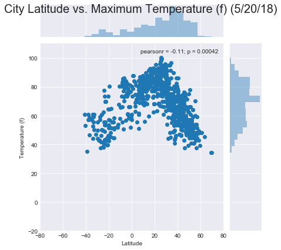
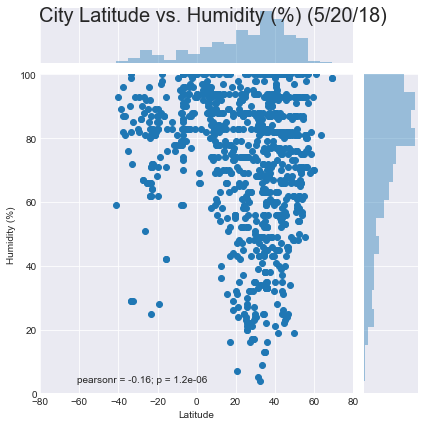
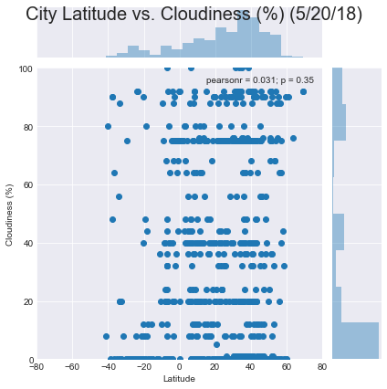
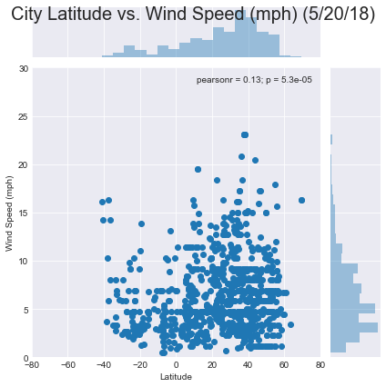
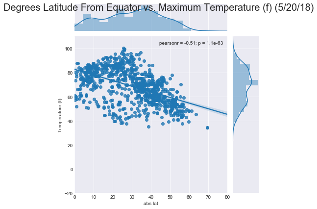

# WeatherPy (Python API Homework)

### Analysis
* Latitude
    * There is more land, people, and cities in the northern hemisphere.
    * Hence the density of the data will naturally skew toward the positive latitudes with a purely random sample.
    * Future research could use a stratified sampling method if actual latitude is the measure of the independent variable.
* Latitude vs. Temperature
    * Results showed a significant (p<0.05) but weak negative (r=-0.11) correlation between latitude and temperature. 
    * This data does not allow us to assume a significant difference in temperature based on latitude.
    * However there is a visable increase near the equator on the plot. 
    * This outcome is likely because the sample includes actual latitudes of cities in both the northern and southern hemispheres. 
    * Future analysis could include a selective sampling process to test one hemisphere at a time or take the absolute value. (see appendix)
* Latitude vs. Humidity
    * As with temperature, there is a significant (p<0.05) but weak negative (r=-0.16) correlation between latitude and humidity.
    * The distribution of data suggests that latitude and humidity are unrelated.
    * Despite the significant p-value the correlation is spurious and weak.
* Latitude vs. Cloudiness
    * There is absolutely no significant (p=0.35,r=.031) relationship between latitude and cloudiness.
* Latitude vs. Wind Speed
    * There is a significant (p<0.05) but weak (r=0.13) correlation between latitude and wind speed.
    * The visual distribution of data and weak correlation suggest that latitude and wind speed are unrelated.

### Importing Depenedncies and Reading List of Cities
* List of cities from 'www.maxmind.com/en/free-world-cities-database'
* Citipy utilizes the same data see 'https://github.com/wingchen/citipy'


```python
import pandas as pd
import numpy as np
import requests
import json
import matplotlib.pyplot as plt
import seaborn as sns
from pprint import pprint
```

* Be sure to add a new API key to 'config.py'. I am deauthorizing this key before posting to github for obvious reasons


```python
#API Key
from config import api_key
#print(api_key)
```

* Read csv, select cities with pop >= 50,000, and select unique latitudes
* This is to ensure better geographic distribution and clean up data


```python
cities = pd.read_csv('city_list.csv', header=0)
cities = cities[np.isfinite(cities['Population'])]
cities = cities[cities['Population'].values >=50000]
cities.drop_duplicates(subset='Latitude', keep='first', inplace=False)
cities.reset_index(drop=True)
cities.count()
```

    /anaconda3/lib/python3.6/site-packages/IPython/core/interactiveshell.py:2728: DtypeWarning: Columns (3) have mixed types. Specify dtype option on import or set low_memory=False.
      interactivity=interactivity, compiler=compiler, result=result)


    Country       7279
    City          7279
    AccentCity    7279
    Region        7279
    Population    7279
    Latitude      7279
    Longitude     7279
    dtype: int64


### Sample Selection and API Calls

* Select random sample and remove unused variables 


```python
sample_cities = cities.sample(n=1000)
sample_cities.drop('AccentCity', axis=1, inplace=True)
sample_cities.drop('Region', axis=1, inplace=True)
sample_cities.drop('Population', axis=1, inplace=True)
sample_cities.reset_index(drop=True)
```


<div>
<style scoped>
    .dataframe tbody tr th:only-of-type {
        vertical-align: middle;
    }

    .dataframe tbody tr th {
        vertical-align: top;
    }

    .dataframe thead th {
        text-align: right;
    }
</style>
<table border="1" class="dataframe">
  <thead>
    <tr style="text-align: right;">
      <th></th>
      <th>Country</th>
      <th>City</th>
      <th>Latitude</th>
      <th>Longitude</th>
    </tr>
  </thead>
  <tbody>
    <tr>
      <th>0</th>
      <td>ru</td>
      <td>kaspiysk</td>
      <td>42.881648</td>
      <td>47.639194</td>
    </tr>
    <tr>
      <th>1</th>
      <td>zw</td>
      <td>marondera</td>
      <td>-18.183333</td>
      <td>31.550000</td>
    </tr>
    <tr>
      <th>2</th>
      <td>jp</td>
      <td>tachikawa</td>
      <td>35.692778</td>
      <td>139.418056</td>
    </tr>
    <tr>
      <th>3</th>
      <td>es</td>
      <td>malaga</td>
      <td>36.726666</td>
      <td>-4.434802</td>
    </tr>
    <tr>
      <th>4</th>
      <td>us</td>
      <td>lafayette</td>
      <td>30.223889</td>
      <td>-92.019722</td>
    </tr>
    <tr>
      <th>5</th>
      <td>br</td>
      <td>penapolis</td>
      <td>-21.400000</td>
      <td>-50.066667</td>
    </tr>
    <tr>
      <th>6</th>
      <td>ke</td>
      <td>nyeri</td>
      <td>-0.416667</td>
      <td>36.950000</td>
    </tr>
    <tr>
      <th>7</th>
      <td>es</td>
      <td>valencia</td>
      <td>39.466667</td>
      <td>-0.366667</td>
    </tr>
    <tr>
      <th>8</th>
      <td>us</td>
      <td>milwaukee</td>
      <td>43.038889</td>
      <td>-87.906389</td>
    </tr>
    <tr>
      <th>9</th>
      <td>md</td>
      <td>chisinau</td>
      <td>47.005556</td>
      <td>28.857500</td>
    </tr>
    <tr>
      <th>10</th>
      <td>cn</td>
      <td>anshun</td>
      <td>26.250000</td>
      <td>105.933333</td>
    </tr>
    <tr>
      <th>11</th>
      <td>cn</td>
      <td>guiren</td>
      <td>33.669722</td>
      <td>118.188889</td>
    </tr>
    <tr>
      <th>12</th>
      <td>br</td>
      <td>planaltina</td>
      <td>-15.616667</td>
      <td>-47.666667</td>
    </tr>
    <tr>
      <th>13</th>
      <td>us</td>
      <td>des plaines</td>
      <td>42.033333</td>
      <td>-87.883333</td>
    </tr>
    <tr>
      <th>14</th>
      <td>cn</td>
      <td>shuangcheng</td>
      <td>45.350000</td>
      <td>126.283333</td>
    </tr>
    <tr>
      <th>15</th>
      <td>cn</td>
      <td>zhaocheng</td>
      <td>37.359167</td>
      <td>120.396389</td>
    </tr>
    <tr>
      <th>16</th>
      <td>jp</td>
      <td>sakura</td>
      <td>35.716667</td>
      <td>140.233333</td>
    </tr>
    <tr>
      <th>17</th>
      <td>cn</td>
      <td>meihekou</td>
      <td>42.527222</td>
      <td>125.675278</td>
    </tr>
    <tr>
      <th>18</th>
      <td>cn</td>
      <td>yima</td>
      <td>34.738056</td>
      <td>111.883889</td>
    </tr>
    <tr>
      <th>19</th>
      <td>gb</td>
      <td>peterborough</td>
      <td>52.583333</td>
      <td>-0.250000</td>
    </tr>
    <tr>
      <th>20</th>
      <td>ph</td>
      <td>cotabato</td>
      <td>7.223611</td>
      <td>124.246389</td>
    </tr>
    <tr>
      <th>21</th>
      <td>br</td>
      <td>caraguatatuba</td>
      <td>-23.616667</td>
      <td>-45.416667</td>
    </tr>
    <tr>
      <th>22</th>
      <td>it</td>
      <td>monza</td>
      <td>45.583333</td>
      <td>9.266667</td>
    </tr>
    <tr>
      <th>23</th>
      <td>bd</td>
      <td>manikganj</td>
      <td>23.855278</td>
      <td>90.012500</td>
    </tr>
    <tr>
      <th>24</th>
      <td>in</td>
      <td>dhule</td>
      <td>20.900000</td>
      <td>74.783333</td>
    </tr>
    <tr>
      <th>25</th>
      <td>cn</td>
      <td>jiaxing</td>
      <td>30.752198</td>
      <td>120.749997</td>
    </tr>
    <tr>
      <th>26</th>
      <td>us</td>
      <td>rio rancho</td>
      <td>35.233333</td>
      <td>-106.663889</td>
    </tr>
    <tr>
      <th>27</th>
      <td>in</td>
      <td>sirhind</td>
      <td>30.645556</td>
      <td>76.382500</td>
    </tr>
    <tr>
      <th>28</th>
      <td>ca</td>
      <td>winnipeg</td>
      <td>49.883333</td>
      <td>-97.166667</td>
    </tr>
    <tr>
      <th>29</th>
      <td>ng</td>
      <td>ikorodu</td>
      <td>6.615483</td>
      <td>3.508673</td>
    </tr>
    <tr>
      <th>...</th>
      <td>...</td>
      <td>...</td>
      <td>...</td>
      <td>...</td>
    </tr>
    <tr>
      <th>970</th>
      <td>cn</td>
      <td>rongcheng</td>
      <td>26.266667</td>
      <td>104.016667</td>
    </tr>
    <tr>
      <th>971</th>
      <td>jp</td>
      <td>akiruno</td>
      <td>35.749435</td>
      <td>139.248346</td>
    </tr>
    <tr>
      <th>972</th>
      <td>bg</td>
      <td>sofia</td>
      <td>42.683333</td>
      <td>23.316667</td>
    </tr>
    <tr>
      <th>973</th>
      <td>us</td>
      <td>springfield</td>
      <td>39.924167</td>
      <td>-83.808889</td>
    </tr>
    <tr>
      <th>974</th>
      <td>ru</td>
      <td>pavlovskiy posad</td>
      <td>55.780713</td>
      <td>38.654475</td>
    </tr>
    <tr>
      <th>975</th>
      <td>cn</td>
      <td>xiaolan</td>
      <td>22.673811</td>
      <td>113.231874</td>
    </tr>
    <tr>
      <th>976</th>
      <td>us</td>
      <td>scranton</td>
      <td>41.408889</td>
      <td>-75.662778</td>
    </tr>
    <tr>
      <th>977</th>
      <td>id</td>
      <td>wonosari</td>
      <td>-7.306111</td>
      <td>110.773889</td>
    </tr>
    <tr>
      <th>978</th>
      <td>in</td>
      <td>jamshedpur</td>
      <td>22.800000</td>
      <td>86.183333</td>
    </tr>
    <tr>
      <th>979</th>
      <td>mz</td>
      <td>chokwe</td>
      <td>-24.533333</td>
      <td>32.983333</td>
    </tr>
    <tr>
      <th>980</th>
      <td>us</td>
      <td>scottsdale</td>
      <td>33.509167</td>
      <td>-111.898333</td>
    </tr>
    <tr>
      <th>981</th>
      <td>br</td>
      <td>irece</td>
      <td>-11.300000</td>
      <td>-41.866667</td>
    </tr>
    <tr>
      <th>982</th>
      <td>co</td>
      <td>caldas</td>
      <td>6.091056</td>
      <td>-75.635690</td>
    </tr>
    <tr>
      <th>983</th>
      <td>cn</td>
      <td>taixing</td>
      <td>32.166667</td>
      <td>120.013611</td>
    </tr>
    <tr>
      <th>984</th>
      <td>ru</td>
      <td>velikiy novgorod</td>
      <td>58.516667</td>
      <td>31.283333</td>
    </tr>
    <tr>
      <th>985</th>
      <td>gb</td>
      <td>bangor</td>
      <td>54.650000</td>
      <td>-5.700000</td>
    </tr>
    <tr>
      <th>986</th>
      <td>ng</td>
      <td>igboho</td>
      <td>8.833333</td>
      <td>3.750000</td>
    </tr>
    <tr>
      <th>987</th>
      <td>kz</td>
      <td>zhezkazgan</td>
      <td>47.783333</td>
      <td>67.766667</td>
    </tr>
    <tr>
      <th>988</th>
      <td>np</td>
      <td>lalitpur</td>
      <td>27.666667</td>
      <td>85.333333</td>
    </tr>
    <tr>
      <th>989</th>
      <td>eg</td>
      <td>asyut</td>
      <td>27.182778</td>
      <td>31.182778</td>
    </tr>
    <tr>
      <th>990</th>
      <td>cd</td>
      <td>butembo</td>
      <td>0.150000</td>
      <td>29.283333</td>
    </tr>
    <tr>
      <th>991</th>
      <td>uz</td>
      <td>guliston</td>
      <td>40.489722</td>
      <td>68.784167</td>
    </tr>
    <tr>
      <th>992</th>
      <td>br</td>
      <td>catalao</td>
      <td>-18.166667</td>
      <td>-47.950000</td>
    </tr>
    <tr>
      <th>993</th>
      <td>tz</td>
      <td>sumbawanga</td>
      <td>-7.966667</td>
      <td>31.616667</td>
    </tr>
    <tr>
      <th>994</th>
      <td>cn</td>
      <td>jinxi</td>
      <td>40.764317</td>
      <td>120.853270</td>
    </tr>
    <tr>
      <th>995</th>
      <td>br</td>
      <td>suzano</td>
      <td>-23.533333</td>
      <td>-46.333333</td>
    </tr>
    <tr>
      <th>996</th>
      <td>br</td>
      <td>uberaba</td>
      <td>-19.750000</td>
      <td>-47.916667</td>
    </tr>
    <tr>
      <th>997</th>
      <td>us</td>
      <td>winston-salem</td>
      <td>36.099722</td>
      <td>-80.244444</td>
    </tr>
    <tr>
      <th>998</th>
      <td>ir</td>
      <td>kazerun</td>
      <td>29.619491</td>
      <td>51.654147</td>
    </tr>
    <tr>
      <th>999</th>
      <td>do</td>
      <td>puerto plata</td>
      <td>19.800000</td>
      <td>-70.683333</td>
    </tr>
  </tbody>
</table>
<p>1000 rows × 4 columns</p>
</div>


* Loop through sample cities for weather conditions and write to dataframe


```python
url = "http://api.openweathermap.org/data/2.5/weather?"
units = "Imperial"
for index, row in sample_cities.iterrows():

    country = row['Country']
    city = row['City']
    query_url = f"{url}units={units}&APPID={api_key}&q={city},{country}"
    response = requests.get(query_url)
    results = response.json()
    pprint(query_url)
    try:
        sample_cities.loc[index,'Temperature (f)'] = results["main"]["temp_max"]
        sample_cities.loc[index,'Humidity (%)'] = results["main"]["humidity"]
        sample_cities.loc[index,'Cloudiness (%)'] = results["clouds"]["all"]
        sample_cities.loc[index,'Wind Speed (mph)'] = results["wind"]["speed"]
    except KeyError:
        pass
```

    'http://api.openweathermap.org/data/2.5/weather?units=Imperial&APPID=2178366abd64d9f8cc96b64ab0063b85&q=kaspiysk,ru'
    'http://api.openweathermap.org/data/2.5/weather?units=Imperial&APPID=2178366abd64d9f8cc96b64ab0063b85&q=marondera,zw'
    'http://api.openweathermap.org/data/2.5/weather?units=Imperial&APPID=2178366abd64d9f8cc96b64ab0063b85&q=tachikawa,jp'
    'http://api.openweathermap.org/data/2.5/weather?units=Imperial&APPID=2178366abd64d9f8cc96b64ab0063b85&q=malaga,es'
    'http://api.openweathermap.org/data/2.5/weather?units=Imperial&APPID=2178366abd64d9f8cc96b64ab0063b85&q=lafayette,us'
    'http://api.openweathermap.org/data/2.5/weather?units=Imperial&APPID=2178366abd64d9f8cc96b64ab0063b85&q=penapolis,br'
    'http://api.openweathermap.org/data/2.5/weather?units=Imperial&APPID=2178366abd64d9f8cc96b64ab0063b85&q=nyeri,ke'
    'http://api.openweathermap.org/data/2.5/weather?units=Imperial&APPID=2178366abd64d9f8cc96b64ab0063b85&q=valencia,es'
    'http://api.openweathermap.org/data/2.5/weather?units=Imperial&APPID=2178366abd64d9f8cc96b64ab0063b85&q=milwaukee,us'
    'http://api.openweathermap.org/data/2.5/weather?units=Imperial&APPID=2178366abd64d9f8cc96b64ab0063b85&q=chisinau,md'
    'http://api.openweathermap.org/data/2.5/weather?units=Imperial&APPID=2178366abd64d9f8cc96b64ab0063b85&q=anshun,cn'
    'http://api.openweathermap.org/data/2.5/weather?units=Imperial&APPID=2178366abd64d9f8cc96b64ab0063b85&q=guiren,cn'
    'http://api.openweathermap.org/data/2.5/weather?units=Imperial&APPID=2178366abd64d9f8cc96b64ab0063b85&q=planaltina,br'
    ('http://api.openweathermap.org/data/2.5/weather?units=Imperial&APPID=2178366abd64d9f8cc96b64ab0063b85&q=des '
     'plaines,us')
    'http://api.openweathermap.org/data/2.5/weather?units=Imperial&APPID=2178366abd64d9f8cc96b64ab0063b85&q=shuangcheng,cn'
    'http://api.openweathermap.org/data/2.5/weather?units=Imperial&APPID=2178366abd64d9f8cc96b64ab0063b85&q=zhaocheng,cn'
    'http://api.openweathermap.org/data/2.5/weather?units=Imperial&APPID=2178366abd64d9f8cc96b64ab0063b85&q=sakura,jp'
    'http://api.openweathermap.org/data/2.5/weather?units=Imperial&APPID=2178366abd64d9f8cc96b64ab0063b85&q=meihekou,cn'
    'http://api.openweathermap.org/data/2.5/weather?units=Imperial&APPID=2178366abd64d9f8cc96b64ab0063b85&q=yima,cn'
    'http://api.openweathermap.org/data/2.5/weather?units=Imperial&APPID=2178366abd64d9f8cc96b64ab0063b85&q=peterborough,gb'
    'http://api.openweathermap.org/data/2.5/weather?units=Imperial&APPID=2178366abd64d9f8cc96b64ab0063b85&q=cotabato,ph'
    'http://api.openweathermap.org/data/2.5/weather?units=Imperial&APPID=2178366abd64d9f8cc96b64ab0063b85&q=caraguatatuba,br'
    'http://api.openweathermap.org/data/2.5/weather?units=Imperial&APPID=2178366abd64d9f8cc96b64ab0063b85&q=monza,it'
    'http://api.openweathermap.org/data/2.5/weather?units=Imperial&APPID=2178366abd64d9f8cc96b64ab0063b85&q=manikganj,bd'
    'http://api.openweathermap.org/data/2.5/weather?units=Imperial&APPID=2178366abd64d9f8cc96b64ab0063b85&q=dhule,in'
    'http://api.openweathermap.org/data/2.5/weather?units=Imperial&APPID=2178366abd64d9f8cc96b64ab0063b85&q=jiaxing,cn'
    ('http://api.openweathermap.org/data/2.5/weather?units=Imperial&APPID=2178366abd64d9f8cc96b64ab0063b85&q=rio '
     'rancho,us')
    'http://api.openweathermap.org/data/2.5/weather?units=Imperial&APPID=2178366abd64d9f8cc96b64ab0063b85&q=sirhind,in'
    'http://api.openweathermap.org/data/2.5/weather?units=Imperial&APPID=2178366abd64d9f8cc96b64ab0063b85&q=winnipeg,ca'
    'http://api.openweathermap.org/data/2.5/weather?units=Imperial&APPID=2178366abd64d9f8cc96b64ab0063b85&q=ikorodu,ng'
    'http://api.openweathermap.org/data/2.5/weather?units=Imperial&APPID=2178366abd64d9f8cc96b64ab0063b85&q=neyveli,in'
    'http://api.openweathermap.org/data/2.5/weather?units=Imperial&APPID=2178366abd64d9f8cc96b64ab0063b85&q=prabumulih,id'
    'http://api.openweathermap.org/data/2.5/weather?units=Imperial&APPID=2178366abd64d9f8cc96b64ab0063b85&q=gdansk,pl'
    'http://api.openweathermap.org/data/2.5/weather?units=Imperial&APPID=2178366abd64d9f8cc96b64ab0063b85&q=chas,in'
    ('http://api.openweathermap.org/data/2.5/weather?units=Imperial&APPID=2178366abd64d9f8cc96b64ab0063b85&q=west '
     'allis,us')
    'http://api.openweathermap.org/data/2.5/weather?units=Imperial&APPID=2178366abd64d9f8cc96b64ab0063b85&q=sukaraja,id'
    'http://api.openweathermap.org/data/2.5/weather?units=Imperial&APPID=2178366abd64d9f8cc96b64ab0063b85&q=deltona,us'
    'http://api.openweathermap.org/data/2.5/weather?units=Imperial&APPID=2178366abd64d9f8cc96b64ab0063b85&q=ashdod,il'
    'http://api.openweathermap.org/data/2.5/weather?units=Imperial&APPID=2178366abd64d9f8cc96b64ab0063b85&q=sunderland,gb'
    'http://api.openweathermap.org/data/2.5/weather?units=Imperial&APPID=2178366abd64d9f8cc96b64ab0063b85&q=bokaro,in'
    'http://api.openweathermap.org/data/2.5/weather?units=Imperial&APPID=2178366abd64d9f8cc96b64ab0063b85&q=iwakuni,jp'
    'http://api.openweathermap.org/data/2.5/weather?units=Imperial&APPID=2178366abd64d9f8cc96b64ab0063b85&q=freetown,sl'
    'http://api.openweathermap.org/data/2.5/weather?units=Imperial&APPID=2178366abd64d9f8cc96b64ab0063b85&q=suihua,cn'
    ('http://api.openweathermap.org/data/2.5/weather?units=Imperial&APPID=2178366abd64d9f8cc96b64ab0063b85&q=yuba '
     'city,us')
    'http://api.openweathermap.org/data/2.5/weather?units=Imperial&APPID=2178366abd64d9f8cc96b64ab0063b85&q=renton,us'
    ('http://api.openweathermap.org/data/2.5/weather?units=Imperial&APPID=2178366abd64d9f8cc96b64ab0063b85&q=south '
     'san francisco,us')
    'http://api.openweathermap.org/data/2.5/weather?units=Imperial&APPID=2178366abd64d9f8cc96b64ab0063b85&q=auchi,ng'
    'http://api.openweathermap.org/data/2.5/weather?units=Imperial&APPID=2178366abd64d9f8cc96b64ab0063b85&q=luan,cn'
    'http://api.openweathermap.org/data/2.5/weather?units=Imperial&APPID=2178366abd64d9f8cc96b64ab0063b85&q=leon,ni'
    'http://api.openweathermap.org/data/2.5/weather?units=Imperial&APPID=2178366abd64d9f8cc96b64ab0063b85&q=kassala,sd'
    'http://api.openweathermap.org/data/2.5/weather?units=Imperial&APPID=2178366abd64d9f8cc96b64ab0063b85&q=braga,pt'
    'http://api.openweathermap.org/data/2.5/weather?units=Imperial&APPID=2178366abd64d9f8cc96b64ab0063b85&q=cidahu,id'
    'http://api.openweathermap.org/data/2.5/weather?units=Imperial&APPID=2178366abd64d9f8cc96b64ab0063b85&q=cubatao,br'
    'http://api.openweathermap.org/data/2.5/weather?units=Imperial&APPID=2178366abd64d9f8cc96b64ab0063b85&q=oceanside,us'
    'http://api.openweathermap.org/data/2.5/weather?units=Imperial&APPID=2178366abd64d9f8cc96b64ab0063b85&q=angren,uz'
    'http://api.openweathermap.org/data/2.5/weather?units=Imperial&APPID=2178366abd64d9f8cc96b64ab0063b85&q=pleasanton,us'
    'http://api.openweathermap.org/data/2.5/weather?units=Imperial&APPID=2178366abd64d9f8cc96b64ab0063b85&q=carmichael,us'
    'http://api.openweathermap.org/data/2.5/weather?units=Imperial&APPID=2178366abd64d9f8cc96b64ab0063b85&q=gela,it'
    'http://api.openweathermap.org/data/2.5/weather?units=Imperial&APPID=2178366abd64d9f8cc96b64ab0063b85&q=mudanjiang,cn'
    'http://api.openweathermap.org/data/2.5/weather?units=Imperial&APPID=2178366abd64d9f8cc96b64ab0063b85&q=labinsk,ru'
    ('http://api.openweathermap.org/data/2.5/weather?units=Imperial&APPID=2178366abd64d9f8cc96b64ab0063b85&q=molina '
     'de segura,es')
    'http://api.openweathermap.org/data/2.5/weather?units=Imperial&APPID=2178366abd64d9f8cc96b64ab0063b85&q=kamisu,jp'
    'http://api.openweathermap.org/data/2.5/weather?units=Imperial&APPID=2178366abd64d9f8cc96b64ab0063b85&q=chapeco,br'
    'http://api.openweathermap.org/data/2.5/weather?units=Imperial&APPID=2178366abd64d9f8cc96b64ab0063b85&q=parma,it'
    'http://api.openweathermap.org/data/2.5/weather?units=Imperial&APPID=2178366abd64d9f8cc96b64ab0063b85&q=tanabe,jp'
    'http://api.openweathermap.org/data/2.5/weather?units=Imperial&APPID=2178366abd64d9f8cc96b64ab0063b85&q=huangnihe,cn'
    'http://api.openweathermap.org/data/2.5/weather?units=Imperial&APPID=2178366abd64d9f8cc96b64ab0063b85&q=irbil,iq'
    'http://api.openweathermap.org/data/2.5/weather?units=Imperial&APPID=2178366abd64d9f8cc96b64ab0063b85&q=brandon,us'
    'http://api.openweathermap.org/data/2.5/weather?units=Imperial&APPID=2178366abd64d9f8cc96b64ab0063b85&q=biu,ng'
    'http://api.openweathermap.org/data/2.5/weather?units=Imperial&APPID=2178366abd64d9f8cc96b64ab0063b85&q=orhangazi,tr'
    'http://api.openweathermap.org/data/2.5/weather?units=Imperial&APPID=2178366abd64d9f8cc96b64ab0063b85&q=koson,uz'
    'http://api.openweathermap.org/data/2.5/weather?units=Imperial&APPID=2178366abd64d9f8cc96b64ab0063b85&q=gedangan,id'
    'http://api.openweathermap.org/data/2.5/weather?units=Imperial&APPID=2178366abd64d9f8cc96b64ab0063b85&q=sunggal,id'
    'http://api.openweathermap.org/data/2.5/weather?units=Imperial&APPID=2178366abd64d9f8cc96b64ab0063b85&q=islampur,in'
    ('http://api.openweathermap.org/data/2.5/weather?units=Imperial&APPID=2178366abd64d9f8cc96b64ab0063b85&q=baton '
     'rouge,us')
    'http://api.openweathermap.org/data/2.5/weather?units=Imperial&APPID=2178366abd64d9f8cc96b64ab0063b85&q=teplice,cz'
    'http://api.openweathermap.org/data/2.5/weather?units=Imperial&APPID=2178366abd64d9f8cc96b64ab0063b85&q=leicester,gb'
    ('http://api.openweathermap.org/data/2.5/weather?units=Imperial&APPID=2178366abd64d9f8cc96b64ab0063b85&q=san '
     'miguelito,pa')
    'http://api.openweathermap.org/data/2.5/weather?units=Imperial&APPID=2178366abd64d9f8cc96b64ab0063b85&q=garbsen,de'
    'http://api.openweathermap.org/data/2.5/weather?units=Imperial&APPID=2178366abd64d9f8cc96b64ab0063b85&q=latacunga,ec'
    'http://api.openweathermap.org/data/2.5/weather?units=Imperial&APPID=2178366abd64d9f8cc96b64ab0063b85&q=talnakh,ru'
    'http://api.openweathermap.org/data/2.5/weather?units=Imperial&APPID=2178366abd64d9f8cc96b64ab0063b85&q=mannheim,de'
    'http://api.openweathermap.org/data/2.5/weather?units=Imperial&APPID=2178366abd64d9f8cc96b64ab0063b85&q=warsaw,pl'
    'http://api.openweathermap.org/data/2.5/weather?units=Imperial&APPID=2178366abd64d9f8cc96b64ab0063b85&q=idappadi,in'
    ('http://api.openweathermap.org/data/2.5/weather?units=Imperial&APPID=2178366abd64d9f8cc96b64ab0063b85&q=newcastle '
     'upon tyne,gb')
    'http://api.openweathermap.org/data/2.5/weather?units=Imperial&APPID=2178366abd64d9f8cc96b64ab0063b85&q=goiania,br'
    'http://api.openweathermap.org/data/2.5/weather?units=Imperial&APPID=2178366abd64d9f8cc96b64ab0063b85&q=wuzhou,cn'
    'http://api.openweathermap.org/data/2.5/weather?units=Imperial&APPID=2178366abd64d9f8cc96b64ab0063b85&q=velsen,nl'
    'http://api.openweathermap.org/data/2.5/weather?units=Imperial&APPID=2178366abd64d9f8cc96b64ab0063b85&q=bursa,tr'
    'http://api.openweathermap.org/data/2.5/weather?units=Imperial&APPID=2178366abd64d9f8cc96b64ab0063b85&q=kentau,kz'
    'http://api.openweathermap.org/data/2.5/weather?units=Imperial&APPID=2178366abd64d9f8cc96b64ab0063b85&q=achalpur,in'
    'http://api.openweathermap.org/data/2.5/weather?units=Imperial&APPID=2178366abd64d9f8cc96b64ab0063b85&q=haldwani,in'
    ('http://api.openweathermap.org/data/2.5/weather?units=Imperial&APPID=2178366abd64d9f8cc96b64ab0063b85&q=santiago '
     'de cuba,cu')
    'http://api.openweathermap.org/data/2.5/weather?units=Imperial&APPID=2178366abd64d9f8cc96b64ab0063b85&q=khandwa,in'
    'http://api.openweathermap.org/data/2.5/weather?units=Imperial&APPID=2178366abd64d9f8cc96b64ab0063b85&q=jinchengjiang,cn'
    'http://api.openweathermap.org/data/2.5/weather?units=Imperial&APPID=2178366abd64d9f8cc96b64ab0063b85&q=ulan-ude,ru'
    'http://api.openweathermap.org/data/2.5/weather?units=Imperial&APPID=2178366abd64d9f8cc96b64ab0063b85&q=amreli,in'
    'http://api.openweathermap.org/data/2.5/weather?units=Imperial&APPID=2178366abd64d9f8cc96b64ab0063b85&q=norfolk,us'
    'http://api.openweathermap.org/data/2.5/weather?units=Imperial&APPID=2178366abd64d9f8cc96b64ab0063b85&q=woodbury,us'
    ('http://api.openweathermap.org/data/2.5/weather?units=Imperial&APPID=2178366abd64d9f8cc96b64ab0063b85&q=mandi '
     'bahauddin,pk')
    'http://api.openweathermap.org/data/2.5/weather?units=Imperial&APPID=2178366abd64d9f8cc96b64ab0063b85&q=marburg,de'
    ('http://api.openweathermap.org/data/2.5/weather?units=Imperial&APPID=2178366abd64d9f8cc96b64ab0063b85&q=fort '
     'beaufort,za')
    'http://api.openweathermap.org/data/2.5/weather?units=Imperial&APPID=2178366abd64d9f8cc96b64ab0063b85&q=dongying,cn'
    'http://api.openweathermap.org/data/2.5/weather?units=Imperial&APPID=2178366abd64d9f8cc96b64ab0063b85&q=astrakhan,ru'
    'http://api.openweathermap.org/data/2.5/weather?units=Imperial&APPID=2178366abd64d9f8cc96b64ab0063b85&q=anyama,ci'
    'http://api.openweathermap.org/data/2.5/weather?units=Imperial&APPID=2178366abd64d9f8cc96b64ab0063b85&q=xuanhua,cn'
    'http://api.openweathermap.org/data/2.5/weather?units=Imperial&APPID=2178366abd64d9f8cc96b64ab0063b85&q=jind,in'
    'http://api.openweathermap.org/data/2.5/weather?units=Imperial&APPID=2178366abd64d9f8cc96b64ab0063b85&q=rionegro,co'
    'http://api.openweathermap.org/data/2.5/weather?units=Imperial&APPID=2178366abd64d9f8cc96b64ab0063b85&q=jambi,id'
    'http://api.openweathermap.org/data/2.5/weather?units=Imperial&APPID=2178366abd64d9f8cc96b64ab0063b85&q=sangmelima,cm'
    'http://api.openweathermap.org/data/2.5/weather?units=Imperial&APPID=2178366abd64d9f8cc96b64ab0063b85&q=casoria,it'
    'http://api.openweathermap.org/data/2.5/weather?units=Imperial&APPID=2178366abd64d9f8cc96b64ab0063b85&q=dayong,cn'
    'http://api.openweathermap.org/data/2.5/weather?units=Imperial&APPID=2178366abd64d9f8cc96b64ab0063b85&q=bais,ph'
    'http://api.openweathermap.org/data/2.5/weather?units=Imperial&APPID=2178366abd64d9f8cc96b64ab0063b85&q=netanya,il'
    'http://api.openweathermap.org/data/2.5/weather?units=Imperial&APPID=2178366abd64d9f8cc96b64ab0063b85&q=pergamino,ar'
    'http://api.openweathermap.org/data/2.5/weather?units=Imperial&APPID=2178366abd64d9f8cc96b64ab0063b85&q=medford,us'
    ('http://api.openweathermap.org/data/2.5/weather?units=Imperial&APPID=2178366abd64d9f8cc96b64ab0063b85&q=redondo '
     'beach,us')
    'http://api.openweathermap.org/data/2.5/weather?units=Imperial&APPID=2178366abd64d9f8cc96b64ab0063b85&q=mokama,in'
    'http://api.openweathermap.org/data/2.5/weather?units=Imperial&APPID=2178366abd64d9f8cc96b64ab0063b85&q=ozubulu,ng'
    'http://api.openweathermap.org/data/2.5/weather?units=Imperial&APPID=2178366abd64d9f8cc96b64ab0063b85&q=redding,us'
    'http://api.openweathermap.org/data/2.5/weather?units=Imperial&APPID=2178366abd64d9f8cc96b64ab0063b85&q=yerevan,am'
    'http://api.openweathermap.org/data/2.5/weather?units=Imperial&APPID=2178366abd64d9f8cc96b64ab0063b85&q=pathein,mm'
    'http://api.openweathermap.org/data/2.5/weather?units=Imperial&APPID=2178366abd64d9f8cc96b64ab0063b85&q=khardaha,in'
    'http://api.openweathermap.org/data/2.5/weather?units=Imperial&APPID=2178366abd64d9f8cc96b64ab0063b85&q=xiamen,cn'
    'http://api.openweathermap.org/data/2.5/weather?units=Imperial&APPID=2178366abd64d9f8cc96b64ab0063b85&q=chieti,it'
    'http://api.openweathermap.org/data/2.5/weather?units=Imperial&APPID=2178366abd64d9f8cc96b64ab0063b85&q=pabianice,pl'
    'http://api.openweathermap.org/data/2.5/weather?units=Imperial&APPID=2178366abd64d9f8cc96b64ab0063b85&q=tamworth,gb'
    'http://api.openweathermap.org/data/2.5/weather?units=Imperial&APPID=2178366abd64d9f8cc96b64ab0063b85&q=heerlen,nl'
    'http://api.openweathermap.org/data/2.5/weather?units=Imperial&APPID=2178366abd64d9f8cc96b64ab0063b85&q=colton,us'
    ('http://api.openweathermap.org/data/2.5/weather?units=Imperial&APPID=2178366abd64d9f8cc96b64ab0063b85&q=cuautitlan '
     'izcalli,mx')
    ('http://api.openweathermap.org/data/2.5/weather?units=Imperial&APPID=2178366abd64d9f8cc96b64ab0063b85&q=santa '
     'cruz de tenerife,es')
    'http://api.openweathermap.org/data/2.5/weather?units=Imperial&APPID=2178366abd64d9f8cc96b64ab0063b85&q=markapur,in'
    'http://api.openweathermap.org/data/2.5/weather?units=Imperial&APPID=2178366abd64d9f8cc96b64ab0063b85&q=mahesana,in'
    'http://api.openweathermap.org/data/2.5/weather?units=Imperial&APPID=2178366abd64d9f8cc96b64ab0063b85&q=raigarh,in'
    'http://api.openweathermap.org/data/2.5/weather?units=Imperial&APPID=2178366abd64d9f8cc96b64ab0063b85&q=izumi,jp'
    'http://api.openweathermap.org/data/2.5/weather?units=Imperial&APPID=2178366abd64d9f8cc96b64ab0063b85&q=wah,pk'
    'http://api.openweathermap.org/data/2.5/weather?units=Imperial&APPID=2178366abd64d9f8cc96b64ab0063b85&q=dundalk,us'
    'http://api.openweathermap.org/data/2.5/weather?units=Imperial&APPID=2178366abd64d9f8cc96b64ab0063b85&q=tottori,jp'
    'http://api.openweathermap.org/data/2.5/weather?units=Imperial&APPID=2178366abd64d9f8cc96b64ab0063b85&q=hangu,cn'
    'http://api.openweathermap.org/data/2.5/weather?units=Imperial&APPID=2178366abd64d9f8cc96b64ab0063b85&q=soreang,id'
    'http://api.openweathermap.org/data/2.5/weather?units=Imperial&APPID=2178366abd64d9f8cc96b64ab0063b85&q=uruguaiana,br'
    'http://api.openweathermap.org/data/2.5/weather?units=Imperial&APPID=2178366abd64d9f8cc96b64ab0063b85&q=gresik,id'
    'http://api.openweathermap.org/data/2.5/weather?units=Imperial&APPID=2178366abd64d9f8cc96b64ab0063b85&q=shulan,cn'
    'http://api.openweathermap.org/data/2.5/weather?units=Imperial&APPID=2178366abd64d9f8cc96b64ab0063b85&q=ipojuca,br'
    'http://api.openweathermap.org/data/2.5/weather?units=Imperial&APPID=2178366abd64d9f8cc96b64ab0063b85&q=gorakhpur,in'
    'http://api.openweathermap.org/data/2.5/weather?units=Imperial&APPID=2178366abd64d9f8cc96b64ab0063b85&q=zhenhai,cn'
    'http://api.openweathermap.org/data/2.5/weather?units=Imperial&APPID=2178366abd64d9f8cc96b64ab0063b85&q=baglan,af'
    'http://api.openweathermap.org/data/2.5/weather?units=Imperial&APPID=2178366abd64d9f8cc96b64ab0063b85&q=bistrita,ro'
    'http://api.openweathermap.org/data/2.5/weather?units=Imperial&APPID=2178366abd64d9f8cc96b64ab0063b85&q=queluz,pt'
    'http://api.openweathermap.org/data/2.5/weather?units=Imperial&APPID=2178366abd64d9f8cc96b64ab0063b85&q=chiplun,in'
    'http://api.openweathermap.org/data/2.5/weather?units=Imperial&APPID=2178366abd64d9f8cc96b64ab0063b85&q=khowst,af'
    'http://api.openweathermap.org/data/2.5/weather?units=Imperial&APPID=2178366abd64d9f8cc96b64ab0063b85&q=lynchburg,us'
    'http://api.openweathermap.org/data/2.5/weather?units=Imperial&APPID=2178366abd64d9f8cc96b64ab0063b85&q=muko,jp'
    'http://api.openweathermap.org/data/2.5/weather?units=Imperial&APPID=2178366abd64d9f8cc96b64ab0063b85&q=kara,tg'
    'http://api.openweathermap.org/data/2.5/weather?units=Imperial&APPID=2178366abd64d9f8cc96b64ab0063b85&q=boshan,cn'
    'http://api.openweathermap.org/data/2.5/weather?units=Imperial&APPID=2178366abd64d9f8cc96b64ab0063b85&q=semnan,ir'
    'http://api.openweathermap.org/data/2.5/weather?units=Imperial&APPID=2178366abd64d9f8cc96b64ab0063b85&q=opobo,ng'
    'http://api.openweathermap.org/data/2.5/weather?units=Imperial&APPID=2178366abd64d9f8cc96b64ab0063b85&q=gresham,us'
    'http://api.openweathermap.org/data/2.5/weather?units=Imperial&APPID=2178366abd64d9f8cc96b64ab0063b85&q=gardez,af'
    'http://api.openweathermap.org/data/2.5/weather?units=Imperial&APPID=2178366abd64d9f8cc96b64ab0063b85&q=poltava,ua'
    'http://api.openweathermap.org/data/2.5/weather?units=Imperial&APPID=2178366abd64d9f8cc96b64ab0063b85&q=fujimi,jp'
    'http://api.openweathermap.org/data/2.5/weather?units=Imperial&APPID=2178366abd64d9f8cc96b64ab0063b85&q=sevilla,es'
    ('http://api.openweathermap.org/data/2.5/weather?units=Imperial&APPID=2178366abd64d9f8cc96b64ab0063b85&q=el '
     'faiyum,eg')
    'http://api.openweathermap.org/data/2.5/weather?units=Imperial&APPID=2178366abd64d9f8cc96b64ab0063b85&q=nalgonda,in'
    'http://api.openweathermap.org/data/2.5/weather?units=Imperial&APPID=2178366abd64d9f8cc96b64ab0063b85&q=xiashi,cn'
    'http://api.openweathermap.org/data/2.5/weather?units=Imperial&APPID=2178366abd64d9f8cc96b64ab0063b85&q=carnot,cf'
    'http://api.openweathermap.org/data/2.5/weather?units=Imperial&APPID=2178366abd64d9f8cc96b64ab0063b85&q=pacet,id'
    'http://api.openweathermap.org/data/2.5/weather?units=Imperial&APPID=2178366abd64d9f8cc96b64ab0063b85&q=bankra,in'
    ('http://api.openweathermap.org/data/2.5/weather?units=Imperial&APPID=2178366abd64d9f8cc96b64ab0063b85&q=ponta '
     'grossa,br')
    ('http://api.openweathermap.org/data/2.5/weather?units=Imperial&APPID=2178366abd64d9f8cc96b64ab0063b85&q=vicente '
     'guerrero,mx')
    'http://api.openweathermap.org/data/2.5/weather?units=Imperial&APPID=2178366abd64d9f8cc96b64ab0063b85&q=tyumen,ru'
    'http://api.openweathermap.org/data/2.5/weather?units=Imperial&APPID=2178366abd64d9f8cc96b64ab0063b85&q=otukpo,ng'
    'http://api.openweathermap.org/data/2.5/weather?units=Imperial&APPID=2178366abd64d9f8cc96b64ab0063b85&q=creteil,fr'
    'http://api.openweathermap.org/data/2.5/weather?units=Imperial&APPID=2178366abd64d9f8cc96b64ab0063b85&q=saquarema,br'
    'http://api.openweathermap.org/data/2.5/weather?units=Imperial&APPID=2178366abd64d9f8cc96b64ab0063b85&q=taihe,cn'
    'http://api.openweathermap.org/data/2.5/weather?units=Imperial&APPID=2178366abd64d9f8cc96b64ab0063b85&q=jihlava,cz'
    'http://api.openweathermap.org/data/2.5/weather?units=Imperial&APPID=2178366abd64d9f8cc96b64ab0063b85&q=kipushi,cd'
    'http://api.openweathermap.org/data/2.5/weather?units=Imperial&APPID=2178366abd64d9f8cc96b64ab0063b85&q=haizhou,cn'
    'http://api.openweathermap.org/data/2.5/weather?units=Imperial&APPID=2178366abd64d9f8cc96b64ab0063b85&q=elbistan,tr'
    'http://api.openweathermap.org/data/2.5/weather?units=Imperial&APPID=2178366abd64d9f8cc96b64ab0063b85&q=zhaozhou,cn'
    'http://api.openweathermap.org/data/2.5/weather?units=Imperial&APPID=2178366abd64d9f8cc96b64ab0063b85&q=juchitan,mx'
    'http://api.openweathermap.org/data/2.5/weather?units=Imperial&APPID=2178366abd64d9f8cc96b64ab0063b85&q=kanchanaburi,th'
    'http://api.openweathermap.org/data/2.5/weather?units=Imperial&APPID=2178366abd64d9f8cc96b64ab0063b85&q=lichuan,cn'
    'http://api.openweathermap.org/data/2.5/weather?units=Imperial&APPID=2178366abd64d9f8cc96b64ab0063b85&q=offa,ng'
    'http://api.openweathermap.org/data/2.5/weather?units=Imperial&APPID=2178366abd64d9f8cc96b64ab0063b85&q=erbaa,tr'
    ('http://api.openweathermap.org/data/2.5/weather?units=Imperial&APPID=2178366abd64d9f8cc96b64ab0063b85&q=sunrise '
     'manor,us')
    'http://api.openweathermap.org/data/2.5/weather?units=Imperial&APPID=2178366abd64d9f8cc96b64ab0063b85&q=uvira,cd'
    ('http://api.openweathermap.org/data/2.5/weather?units=Imperial&APPID=2178366abd64d9f8cc96b64ab0063b85&q=san '
     'francisco el alto,gt')
    'http://api.openweathermap.org/data/2.5/weather?units=Imperial&APPID=2178366abd64d9f8cc96b64ab0063b85&q=balkanabat,tm'
    'http://api.openweathermap.org/data/2.5/weather?units=Imperial&APPID=2178366abd64d9f8cc96b64ab0063b85&q=chakwal,pk'
    'http://api.openweathermap.org/data/2.5/weather?units=Imperial&APPID=2178366abd64d9f8cc96b64ab0063b85&q=berwyn,us'
    'http://api.openweathermap.org/data/2.5/weather?units=Imperial&APPID=2178366abd64d9f8cc96b64ab0063b85&q=oxford,gb'
    'http://api.openweathermap.org/data/2.5/weather?units=Imperial&APPID=2178366abd64d9f8cc96b64ab0063b85&q=suceava,ro'
    'http://api.openweathermap.org/data/2.5/weather?units=Imperial&APPID=2178366abd64d9f8cc96b64ab0063b85&q=chilakalurupet,in'
    ('http://api.openweathermap.org/data/2.5/weather?units=Imperial&APPID=2178366abd64d9f8cc96b64ab0063b85&q=nankana '
     'sahib,pk')
    'http://api.openweathermap.org/data/2.5/weather?units=Imperial&APPID=2178366abd64d9f8cc96b64ab0063b85&q=jammu,in'
    ('http://api.openweathermap.org/data/2.5/weather?units=Imperial&APPID=2178366abd64d9f8cc96b64ab0063b85&q=hai '
     'duong,vn')
    'http://api.openweathermap.org/data/2.5/weather?units=Imperial&APPID=2178366abd64d9f8cc96b64ab0063b85&q=kaithal,in'
    'http://api.openweathermap.org/data/2.5/weather?units=Imperial&APPID=2178366abd64d9f8cc96b64ab0063b85&q=bugama,ng'
    'http://api.openweathermap.org/data/2.5/weather?units=Imperial&APPID=2178366abd64d9f8cc96b64ab0063b85&q=arhus,dk'
    'http://api.openweathermap.org/data/2.5/weather?units=Imperial&APPID=2178366abd64d9f8cc96b64ab0063b85&q=bende,ng'
    'http://api.openweathermap.org/data/2.5/weather?units=Imperial&APPID=2178366abd64d9f8cc96b64ab0063b85&q=colombo,br'
    'http://api.openweathermap.org/data/2.5/weather?units=Imperial&APPID=2178366abd64d9f8cc96b64ab0063b85&q=tauranga,nz'
    'http://api.openweathermap.org/data/2.5/weather?units=Imperial&APPID=2178366abd64d9f8cc96b64ab0063b85&q=tartu,ee'
    ('http://api.openweathermap.org/data/2.5/weather?units=Imperial&APPID=2178366abd64d9f8cc96b64ab0063b85&q=velikie '
     'luki,ru')
    'http://api.openweathermap.org/data/2.5/weather?units=Imperial&APPID=2178366abd64d9f8cc96b64ab0063b85&q=shinyanga,tz'
    'http://api.openweathermap.org/data/2.5/weather?units=Imperial&APPID=2178366abd64d9f8cc96b64ab0063b85&q=singkang,id'
    'http://api.openweathermap.org/data/2.5/weather?units=Imperial&APPID=2178366abd64d9f8cc96b64ab0063b85&q=marica,br'
    'http://api.openweathermap.org/data/2.5/weather?units=Imperial&APPID=2178366abd64d9f8cc96b64ab0063b85&q=lorca,es'
    'http://api.openweathermap.org/data/2.5/weather?units=Imperial&APPID=2178366abd64d9f8cc96b64ab0063b85&q=daltenganj,in'
    'http://api.openweathermap.org/data/2.5/weather?units=Imperial&APPID=2178366abd64d9f8cc96b64ab0063b85&q=pemalang,id'
    'http://api.openweathermap.org/data/2.5/weather?units=Imperial&APPID=2178366abd64d9f8cc96b64ab0063b85&q=dunaujvaros,hu'
    'http://api.openweathermap.org/data/2.5/weather?units=Imperial&APPID=2178366abd64d9f8cc96b64ab0063b85&q=pensacola,us'
    'http://api.openweathermap.org/data/2.5/weather?units=Imperial&APPID=2178366abd64d9f8cc96b64ab0063b85&q=numan,ng'
    'http://api.openweathermap.org/data/2.5/weather?units=Imperial&APPID=2178366abd64d9f8cc96b64ab0063b85&q=gaoyou,cn'
    'http://api.openweathermap.org/data/2.5/weather?units=Imperial&APPID=2178366abd64d9f8cc96b64ab0063b85&q=latina,it'
    'http://api.openweathermap.org/data/2.5/weather?units=Imperial&APPID=2178366abd64d9f8cc96b64ab0063b85&q=upleta,in'
    ('http://api.openweathermap.org/data/2.5/weather?units=Imperial&APPID=2178366abd64d9f8cc96b64ab0063b85&q=san '
     'carlos,ph')
    'http://api.openweathermap.org/data/2.5/weather?units=Imperial&APPID=2178366abd64d9f8cc96b64ab0063b85&q=kasuga,jp'
    'http://api.openweathermap.org/data/2.5/weather?units=Imperial&APPID=2178366abd64d9f8cc96b64ab0063b85&q=passos,br'
    ('http://api.openweathermap.org/data/2.5/weather?units=Imperial&APPID=2178366abd64d9f8cc96b64ab0063b85&q=san '
     'cristobal,do')
    'http://api.openweathermap.org/data/2.5/weather?units=Imperial&APPID=2178366abd64d9f8cc96b64ab0063b85&q=maiduguri,ng'
    'http://api.openweathermap.org/data/2.5/weather?units=Imperial&APPID=2178366abd64d9f8cc96b64ab0063b85&q=iquique,cl'
    'http://api.openweathermap.org/data/2.5/weather?units=Imperial&APPID=2178366abd64d9f8cc96b64ab0063b85&q=settsu,jp'
    'http://api.openweathermap.org/data/2.5/weather?units=Imperial&APPID=2178366abd64d9f8cc96b64ab0063b85&q=escuintla,gt'
    'http://api.openweathermap.org/data/2.5/weather?units=Imperial&APPID=2178366abd64d9f8cc96b64ab0063b85&q=alanya,tr'
    'http://api.openweathermap.org/data/2.5/weather?units=Imperial&APPID=2178366abd64d9f8cc96b64ab0063b85&q=iruma,jp'
    'http://api.openweathermap.org/data/2.5/weather?units=Imperial&APPID=2178366abd64d9f8cc96b64ab0063b85&q=amozoc,mx'
    'http://api.openweathermap.org/data/2.5/weather?units=Imperial&APPID=2178366abd64d9f8cc96b64ab0063b85&q=amravati,in'
    'http://api.openweathermap.org/data/2.5/weather?units=Imperial&APPID=2178366abd64d9f8cc96b64ab0063b85&q=grevenbroich,de'
    ('http://api.openweathermap.org/data/2.5/weather?units=Imperial&APPID=2178366abd64d9f8cc96b64ab0063b85&q=las '
     'rozas de madrid,es')
    'http://api.openweathermap.org/data/2.5/weather?units=Imperial&APPID=2178366abd64d9f8cc96b64ab0063b85&q=ciampea,id'
    'http://api.openweathermap.org/data/2.5/weather?units=Imperial&APPID=2178366abd64d9f8cc96b64ab0063b85&q=guacara,ve'
    'http://api.openweathermap.org/data/2.5/weather?units=Imperial&APPID=2178366abd64d9f8cc96b64ab0063b85&q=provo,us'
    'http://api.openweathermap.org/data/2.5/weather?units=Imperial&APPID=2178366abd64d9f8cc96b64ab0063b85&q=ussuriysk,ru'
    'http://api.openweathermap.org/data/2.5/weather?units=Imperial&APPID=2178366abd64d9f8cc96b64ab0063b85&q=lonavale,in'
    'http://api.openweathermap.org/data/2.5/weather?units=Imperial&APPID=2178366abd64d9f8cc96b64ab0063b85&q=konotop,ua'
    'http://api.openweathermap.org/data/2.5/weather?units=Imperial&APPID=2178366abd64d9f8cc96b64ab0063b85&q=nanchong,cn'
    ('http://api.openweathermap.org/data/2.5/weather?units=Imperial&APPID=2178366abd64d9f8cc96b64ab0063b85&q=los '
     'angeles,cl')
    'http://api.openweathermap.org/data/2.5/weather?units=Imperial&APPID=2178366abd64d9f8cc96b64ab0063b85&q=tangping,cn'
    'http://api.openweathermap.org/data/2.5/weather?units=Imperial&APPID=2178366abd64d9f8cc96b64ab0063b85&q=melaka,my'
    'http://api.openweathermap.org/data/2.5/weather?units=Imperial&APPID=2178366abd64d9f8cc96b64ab0063b85&q=campeche,mx'
    'http://api.openweathermap.org/data/2.5/weather?units=Imperial&APPID=2178366abd64d9f8cc96b64ab0063b85&q=malappuram,in'
    ('http://api.openweathermap.org/data/2.5/weather?units=Imperial&APPID=2178366abd64d9f8cc96b64ab0063b85&q=fort '
     'myers,us')
    'http://api.openweathermap.org/data/2.5/weather?units=Imperial&APPID=2178366abd64d9f8cc96b64ab0063b85&q=botou,cn'
    'http://api.openweathermap.org/data/2.5/weather?units=Imperial&APPID=2178366abd64d9f8cc96b64ab0063b85&q=pardubice,cz'
    'http://api.openweathermap.org/data/2.5/weather?units=Imperial&APPID=2178366abd64d9f8cc96b64ab0063b85&q=neiva,co'
    'http://api.openweathermap.org/data/2.5/weather?units=Imperial&APPID=2178366abd64d9f8cc96b64ab0063b85&q=albuquerque,us'
    'http://api.openweathermap.org/data/2.5/weather?units=Imperial&APPID=2178366abd64d9f8cc96b64ab0063b85&q=malanje,ao'
    'http://api.openweathermap.org/data/2.5/weather?units=Imperial&APPID=2178366abd64d9f8cc96b64ab0063b85&q=butare,rw'
    'http://api.openweathermap.org/data/2.5/weather?units=Imperial&APPID=2178366abd64d9f8cc96b64ab0063b85&q=penaflor,cl'
    'http://api.openweathermap.org/data/2.5/weather?units=Imperial&APPID=2178366abd64d9f8cc96b64ab0063b85&q=ilo,pe'
    'http://api.openweathermap.org/data/2.5/weather?units=Imperial&APPID=2178366abd64d9f8cc96b64ab0063b85&q=yigou,cn'
    ('http://api.openweathermap.org/data/2.5/weather?units=Imperial&APPID=2178366abd64d9f8cc96b64ab0063b85&q=deerfield '
     'beach,us')
    'http://api.openweathermap.org/data/2.5/weather?units=Imperial&APPID=2178366abd64d9f8cc96b64ab0063b85&q=petlad,in'
    'http://api.openweathermap.org/data/2.5/weather?units=Imperial&APPID=2178366abd64d9f8cc96b64ab0063b85&q=vineland,us'
    'http://api.openweathermap.org/data/2.5/weather?units=Imperial&APPID=2178366abd64d9f8cc96b64ab0063b85&q=badalona,es'
    ('http://api.openweathermap.org/data/2.5/weather?units=Imperial&APPID=2178366abd64d9f8cc96b64ab0063b85&q=san '
     'luis potosi,mx')
    'http://api.openweathermap.org/data/2.5/weather?units=Imperial&APPID=2178366abd64d9f8cc96b64ab0063b85&q=fethiye,tr'
    'http://api.openweathermap.org/data/2.5/weather?units=Imperial&APPID=2178366abd64d9f8cc96b64ab0063b85&q=suzuka,jp'
    'http://api.openweathermap.org/data/2.5/weather?units=Imperial&APPID=2178366abd64d9f8cc96b64ab0063b85&q=babu,cn'
    'http://api.openweathermap.org/data/2.5/weather?units=Imperial&APPID=2178366abd64d9f8cc96b64ab0063b85&q=corroios,pt'
    'http://api.openweathermap.org/data/2.5/weather?units=Imperial&APPID=2178366abd64d9f8cc96b64ab0063b85&q=tebingtinggi,id'
    'http://api.openweathermap.org/data/2.5/weather?units=Imperial&APPID=2178366abd64d9f8cc96b64ab0063b85&q=hami,cn'
    'http://api.openweathermap.org/data/2.5/weather?units=Imperial&APPID=2178366abd64d9f8cc96b64ab0063b85&q=salavat,ru'
    'http://api.openweathermap.org/data/2.5/weather?units=Imperial&APPID=2178366abd64d9f8cc96b64ab0063b85&q=bharuch,in'
    'http://api.openweathermap.org/data/2.5/weather?units=Imperial&APPID=2178366abd64d9f8cc96b64ab0063b85&q=issia,ci'
    'http://api.openweathermap.org/data/2.5/weather?units=Imperial&APPID=2178366abd64d9f8cc96b64ab0063b85&q=fishers,us'
    'http://api.openweathermap.org/data/2.5/weather?units=Imperial&APPID=2178366abd64d9f8cc96b64ab0063b85&q=sumy,ua'
    'http://api.openweathermap.org/data/2.5/weather?units=Imperial&APPID=2178366abd64d9f8cc96b64ab0063b85&q=anbu,cn'
    'http://api.openweathermap.org/data/2.5/weather?units=Imperial&APPID=2178366abd64d9f8cc96b64ab0063b85&q=rath,in'
    'http://api.openweathermap.org/data/2.5/weather?units=Imperial&APPID=2178366abd64d9f8cc96b64ab0063b85&q=tagbilaran,ph'
    'http://api.openweathermap.org/data/2.5/weather?units=Imperial&APPID=2178366abd64d9f8cc96b64ab0063b85&q=anan,jp'
    ('http://api.openweathermap.org/data/2.5/weather?units=Imperial&APPID=2178366abd64d9f8cc96b64ab0063b85&q=ciego '
     'de avila,cu')
    'http://api.openweathermap.org/data/2.5/weather?units=Imperial&APPID=2178366abd64d9f8cc96b64ab0063b85&q=toyokawa,jp'
    'http://api.openweathermap.org/data/2.5/weather?units=Imperial&APPID=2178366abd64d9f8cc96b64ab0063b85&q=greenville,us'
    'http://api.openweathermap.org/data/2.5/weather?units=Imperial&APPID=2178366abd64d9f8cc96b64ab0063b85&q=hsinchu,tw'
    'http://api.openweathermap.org/data/2.5/weather?units=Imperial&APPID=2178366abd64d9f8cc96b64ab0063b85&q=hannan,jp'
    'http://api.openweathermap.org/data/2.5/weather?units=Imperial&APPID=2178366abd64d9f8cc96b64ab0063b85&q=titagarh,in'
    'http://api.openweathermap.org/data/2.5/weather?units=Imperial&APPID=2178366abd64d9f8cc96b64ab0063b85&q=bolpur,in'
    'http://api.openweathermap.org/data/2.5/weather?units=Imperial&APPID=2178366abd64d9f8cc96b64ab0063b85&q=poole,gb'
    'http://api.openweathermap.org/data/2.5/weather?units=Imperial&APPID=2178366abd64d9f8cc96b64ab0063b85&q=ginowan,jp'
    'http://api.openweathermap.org/data/2.5/weather?units=Imperial&APPID=2178366abd64d9f8cc96b64ab0063b85&q=pittsburg,us'
    'http://api.openweathermap.org/data/2.5/weather?units=Imperial&APPID=2178366abd64d9f8cc96b64ab0063b85&q=apucarana,br'
    'http://api.openweathermap.org/data/2.5/weather?units=Imperial&APPID=2178366abd64d9f8cc96b64ab0063b85&q=porirua,nz'
    'http://api.openweathermap.org/data/2.5/weather?units=Imperial&APPID=2178366abd64d9f8cc96b64ab0063b85&q=kabanjahe,id'
    'http://api.openweathermap.org/data/2.5/weather?units=Imperial&APPID=2178366abd64d9f8cc96b64ab0063b85&q=bendigo,au'
    'http://api.openweathermap.org/data/2.5/weather?units=Imperial&APPID=2178366abd64d9f8cc96b64ab0063b85&q=tateyama,jp'
    'http://api.openweathermap.org/data/2.5/weather?units=Imperial&APPID=2178366abd64d9f8cc96b64ab0063b85&q=ijui,br'
    'http://api.openweathermap.org/data/2.5/weather?units=Imperial&APPID=2178366abd64d9f8cc96b64ab0063b85&q=minsk,by'
    ('http://api.openweathermap.org/data/2.5/weather?units=Imperial&APPID=2178366abd64d9f8cc96b64ab0063b85&q=almirante '
     'tamandare,br')
    'http://api.openweathermap.org/data/2.5/weather?units=Imperial&APPID=2178366abd64d9f8cc96b64ab0063b85&q=merida,es'
    'http://api.openweathermap.org/data/2.5/weather?units=Imperial&APPID=2178366abd64d9f8cc96b64ab0063b85&q=ponce,us'
    'http://api.openweathermap.org/data/2.5/weather?units=Imperial&APPID=2178366abd64d9f8cc96b64ab0063b85&q=xinqing,cn'
    'http://api.openweathermap.org/data/2.5/weather?units=Imperial&APPID=2178366abd64d9f8cc96b64ab0063b85&q=fernandopolis,br'
    'http://api.openweathermap.org/data/2.5/weather?units=Imperial&APPID=2178366abd64d9f8cc96b64ab0063b85&q=negombo,lk'
    'http://api.openweathermap.org/data/2.5/weather?units=Imperial&APPID=2178366abd64d9f8cc96b64ab0063b85&q=fengxian,cn'
    'http://api.openweathermap.org/data/2.5/weather?units=Imperial&APPID=2178366abd64d9f8cc96b64ab0063b85&q=soacha,co'
    'http://api.openweathermap.org/data/2.5/weather?units=Imperial&APPID=2178366abd64d9f8cc96b64ab0063b85&q=rockhampton,au'
    'http://api.openweathermap.org/data/2.5/weather?units=Imperial&APPID=2178366abd64d9f8cc96b64ab0063b85&q=itabaiana,br'
    'http://api.openweathermap.org/data/2.5/weather?units=Imperial&APPID=2178366abd64d9f8cc96b64ab0063b85&q=madhubani,in'
    'http://api.openweathermap.org/data/2.5/weather?units=Imperial&APPID=2178366abd64d9f8cc96b64ab0063b85&q=machala,ec'
    'http://api.openweathermap.org/data/2.5/weather?units=Imperial&APPID=2178366abd64d9f8cc96b64ab0063b85&q=qiongshan,cn'
    'http://api.openweathermap.org/data/2.5/weather?units=Imperial&APPID=2178366abd64d9f8cc96b64ab0063b85&q=agadez,ne'
    'http://api.openweathermap.org/data/2.5/weather?units=Imperial&APPID=2178366abd64d9f8cc96b64ab0063b85&q=caguas,us'
    'http://api.openweathermap.org/data/2.5/weather?units=Imperial&APPID=2178366abd64d9f8cc96b64ab0063b85&q=ahvaz,ir'
    'http://api.openweathermap.org/data/2.5/weather?units=Imperial&APPID=2178366abd64d9f8cc96b64ab0063b85&q=horsens,dk'
    ('http://api.openweathermap.org/data/2.5/weather?units=Imperial&APPID=2178366abd64d9f8cc96b64ab0063b85&q=vitoria '
     'de santo antao,br')
    'http://api.openweathermap.org/data/2.5/weather?units=Imperial&APPID=2178366abd64d9f8cc96b64ab0063b85&q=lokossa,bj'
    'http://api.openweathermap.org/data/2.5/weather?units=Imperial&APPID=2178366abd64d9f8cc96b64ab0063b85&q=raghogarh,in'
    'http://api.openweathermap.org/data/2.5/weather?units=Imperial&APPID=2178366abd64d9f8cc96b64ab0063b85&q=frankfurt,de'
    'http://api.openweathermap.org/data/2.5/weather?units=Imperial&APPID=2178366abd64d9f8cc96b64ab0063b85&q=phuket,th'
    'http://api.openweathermap.org/data/2.5/weather?units=Imperial&APPID=2178366abd64d9f8cc96b64ab0063b85&q=muzaffargarh,pk'
    'http://api.openweathermap.org/data/2.5/weather?units=Imperial&APPID=2178366abd64d9f8cc96b64ab0063b85&q=matamoros,mx'
    'http://api.openweathermap.org/data/2.5/weather?units=Imperial&APPID=2178366abd64d9f8cc96b64ab0063b85&q=montreuil,fr'
    'http://api.openweathermap.org/data/2.5/weather?units=Imperial&APPID=2178366abd64d9f8cc96b64ab0063b85&q=suratgarh,in'
    'http://api.openweathermap.org/data/2.5/weather?units=Imperial&APPID=2178366abd64d9f8cc96b64ab0063b85&q=delmas,ht'
    'http://api.openweathermap.org/data/2.5/weather?units=Imperial&APPID=2178366abd64d9f8cc96b64ab0063b85&q=monclova,mx'
    'http://api.openweathermap.org/data/2.5/weather?units=Imperial&APPID=2178366abd64d9f8cc96b64ab0063b85&q=hanamaki,jp'
    'http://api.openweathermap.org/data/2.5/weather?units=Imperial&APPID=2178366abd64d9f8cc96b64ab0063b85&q=chidambaram,in'
    'http://api.openweathermap.org/data/2.5/weather?units=Imperial&APPID=2178366abd64d9f8cc96b64ab0063b85&q=masaya,ni'
    'http://api.openweathermap.org/data/2.5/weather?units=Imperial&APPID=2178366abd64d9f8cc96b64ab0063b85&q=inisa,ng'
    'http://api.openweathermap.org/data/2.5/weather?units=Imperial&APPID=2178366abd64d9f8cc96b64ab0063b85&q=jyvaskyla,fi'
    'http://api.openweathermap.org/data/2.5/weather?units=Imperial&APPID=2178366abd64d9f8cc96b64ab0063b85&q=baran,in'
    'http://api.openweathermap.org/data/2.5/weather?units=Imperial&APPID=2178366abd64d9f8cc96b64ab0063b85&q=teshie,gh'
    'http://api.openweathermap.org/data/2.5/weather?units=Imperial&APPID=2178366abd64d9f8cc96b64ab0063b85&q=townsville,au'
    'http://api.openweathermap.org/data/2.5/weather?units=Imperial&APPID=2178366abd64d9f8cc96b64ab0063b85&q=imperatriz,br'
    'http://api.openweathermap.org/data/2.5/weather?units=Imperial&APPID=2178366abd64d9f8cc96b64ab0063b85&q=gangoh,in'
    'http://api.openweathermap.org/data/2.5/weather?units=Imperial&APPID=2178366abd64d9f8cc96b64ab0063b85&q=islamabad,pk'
    'http://api.openweathermap.org/data/2.5/weather?units=Imperial&APPID=2178366abd64d9f8cc96b64ab0063b85&q=dabra,in'
    'http://api.openweathermap.org/data/2.5/weather?units=Imperial&APPID=2178366abd64d9f8cc96b64ab0063b85&q=brajrajnagar,in'
    ('http://api.openweathermap.org/data/2.5/weather?units=Imperial&APPID=2178366abd64d9f8cc96b64ab0063b85&q=sawai '
     'madhopur,in')
    'http://api.openweathermap.org/data/2.5/weather?units=Imperial&APPID=2178366abd64d9f8cc96b64ab0063b85&q=kashiba,jp'
    'http://api.openweathermap.org/data/2.5/weather?units=Imperial&APPID=2178366abd64d9f8cc96b64ab0063b85&q=sadiqabad,pk'
    'http://api.openweathermap.org/data/2.5/weather?units=Imperial&APPID=2178366abd64d9f8cc96b64ab0063b85&q=tlalnepantla,mx'
    'http://api.openweathermap.org/data/2.5/weather?units=Imperial&APPID=2178366abd64d9f8cc96b64ab0063b85&q=rzhev,ru'
    'http://api.openweathermap.org/data/2.5/weather?units=Imperial&APPID=2178366abd64d9f8cc96b64ab0063b85&q=lafiagi,ng'
    'http://api.openweathermap.org/data/2.5/weather?units=Imperial&APPID=2178366abd64d9f8cc96b64ab0063b85&q=tumen,cn'
    'http://api.openweathermap.org/data/2.5/weather?units=Imperial&APPID=2178366abd64d9f8cc96b64ab0063b85&q=mawlamyine,mm'
    ('http://api.openweathermap.org/data/2.5/weather?units=Imperial&APPID=2178366abd64d9f8cc96b64ab0063b85&q=league '
     'city,us')
    'http://api.openweathermap.org/data/2.5/weather?units=Imperial&APPID=2178366abd64d9f8cc96b64ab0063b85&q=barranquilla,co'
    'http://api.openweathermap.org/data/2.5/weather?units=Imperial&APPID=2178366abd64d9f8cc96b64ab0063b85&q=brazzaville,cg'
    'http://api.openweathermap.org/data/2.5/weather?units=Imperial&APPID=2178366abd64d9f8cc96b64ab0063b85&q=anjar,in'
    'http://api.openweathermap.org/data/2.5/weather?units=Imperial&APPID=2178366abd64d9f8cc96b64ab0063b85&q=vanderbijlpark,za'
    'http://api.openweathermap.org/data/2.5/weather?units=Imperial&APPID=2178366abd64d9f8cc96b64ab0063b85&q=aquiraz,br'
    'http://api.openweathermap.org/data/2.5/weather?units=Imperial&APPID=2178366abd64d9f8cc96b64ab0063b85&q=poprad,sk'
    'http://api.openweathermap.org/data/2.5/weather?units=Imperial&APPID=2178366abd64d9f8cc96b64ab0063b85&q=kumbo,cm'
    'http://api.openweathermap.org/data/2.5/weather?units=Imperial&APPID=2178366abd64d9f8cc96b64ab0063b85&q=piracicaba,br'
    'http://api.openweathermap.org/data/2.5/weather?units=Imperial&APPID=2178366abd64d9f8cc96b64ab0063b85&q=weinan,cn'
    'http://api.openweathermap.org/data/2.5/weather?units=Imperial&APPID=2178366abd64d9f8cc96b64ab0063b85&q=cholet,fr'
    ('http://api.openweathermap.org/data/2.5/weather?units=Imperial&APPID=2178366abd64d9f8cc96b64ab0063b85&q=ta '
     'khmau,kh')
    'http://api.openweathermap.org/data/2.5/weather?units=Imperial&APPID=2178366abd64d9f8cc96b64ab0063b85&q=dalian,cn'
    ('http://api.openweathermap.org/data/2.5/weather?units=Imperial&APPID=2178366abd64d9f8cc96b64ab0063b85&q=punto '
     'fijo,ve')
    'http://api.openweathermap.org/data/2.5/weather?units=Imperial&APPID=2178366abd64d9f8cc96b64ab0063b85&q=salihli,tr'
    'http://api.openweathermap.org/data/2.5/weather?units=Imperial&APPID=2178366abd64d9f8cc96b64ab0063b85&q=kashiwa,jp'
    'http://api.openweathermap.org/data/2.5/weather?units=Imperial&APPID=2178366abd64d9f8cc96b64ab0063b85&q=ganganagar,in'
    'http://api.openweathermap.org/data/2.5/weather?units=Imperial&APPID=2178366abd64d9f8cc96b64ab0063b85&q=orange,us'
    'http://api.openweathermap.org/data/2.5/weather?units=Imperial&APPID=2178366abd64d9f8cc96b64ab0063b85&q=barueri,br'
    'http://api.openweathermap.org/data/2.5/weather?units=Imperial&APPID=2178366abd64d9f8cc96b64ab0063b85&q=bojnurd,ir'
    ('http://api.openweathermap.org/data/2.5/weather?units=Imperial&APPID=2178366abd64d9f8cc96b64ab0063b85&q=san '
     'juan del rio,mx')
    'http://api.openweathermap.org/data/2.5/weather?units=Imperial&APPID=2178366abd64d9f8cc96b64ab0063b85&q=hengelo,nl'
    'http://api.openweathermap.org/data/2.5/weather?units=Imperial&APPID=2178366abd64d9f8cc96b64ab0063b85&q=tuni,in'
    'http://api.openweathermap.org/data/2.5/weather?units=Imperial&APPID=2178366abd64d9f8cc96b64ab0063b85&q=tsuruga,jp'
    'http://api.openweathermap.org/data/2.5/weather?units=Imperial&APPID=2178366abd64d9f8cc96b64ab0063b85&q=nyanza,rw'
    'http://api.openweathermap.org/data/2.5/weather?units=Imperial&APPID=2178366abd64d9f8cc96b64ab0063b85&q=kamthi,in'
    'http://api.openweathermap.org/data/2.5/weather?units=Imperial&APPID=2178366abd64d9f8cc96b64ab0063b85&q=mingyue,cn'
    'http://api.openweathermap.org/data/2.5/weather?units=Imperial&APPID=2178366abd64d9f8cc96b64ab0063b85&q=hanoi,vn'
    ('http://api.openweathermap.org/data/2.5/weather?units=Imperial&APPID=2178366abd64d9f8cc96b64ab0063b85&q=dale '
     'city,us')
    ('http://api.openweathermap.org/data/2.5/weather?units=Imperial&APPID=2178366abd64d9f8cc96b64ab0063b85&q=novi '
     'pazar,rs')
    'http://api.openweathermap.org/data/2.5/weather?units=Imperial&APPID=2178366abd64d9f8cc96b64ab0063b85&q=nowshera,pk'
    ('http://api.openweathermap.org/data/2.5/weather?units=Imperial&APPID=2178366abd64d9f8cc96b64ab0063b85&q=punta '
     'cardon,ve')
    ('http://api.openweathermap.org/data/2.5/weather?units=Imperial&APPID=2178366abd64d9f8cc96b64ab0063b85&q=apple '
     'valley,us')
    'http://api.openweathermap.org/data/2.5/weather?units=Imperial&APPID=2178366abd64d9f8cc96b64ab0063b85&q=davis,us'
    'http://api.openweathermap.org/data/2.5/weather?units=Imperial&APPID=2178366abd64d9f8cc96b64ab0063b85&q=yalova,tr'
    'http://api.openweathermap.org/data/2.5/weather?units=Imperial&APPID=2178366abd64d9f8cc96b64ab0063b85&q=shulin,tw'
    'http://api.openweathermap.org/data/2.5/weather?units=Imperial&APPID=2178366abd64d9f8cc96b64ab0063b85&q=apartado,co'
    'http://api.openweathermap.org/data/2.5/weather?units=Imperial&APPID=2178366abd64d9f8cc96b64ab0063b85&q=ukhta,ru'
    'http://api.openweathermap.org/data/2.5/weather?units=Imperial&APPID=2178366abd64d9f8cc96b64ab0063b85&q=patna,in'
    'http://api.openweathermap.org/data/2.5/weather?units=Imperial&APPID=2178366abd64d9f8cc96b64ab0063b85&q=funabashi,jp'
    ('http://api.openweathermap.org/data/2.5/weather?units=Imperial&APPID=2178366abd64d9f8cc96b64ab0063b85&q=oklahoma '
     'city,us')
    ('http://api.openweathermap.org/data/2.5/weather?units=Imperial&APPID=2178366abd64d9f8cc96b64ab0063b85&q=port '
     'blair,in')
    'http://api.openweathermap.org/data/2.5/weather?units=Imperial&APPID=2178366abd64d9f8cc96b64ab0063b85&q=jetpur,in'
    'http://api.openweathermap.org/data/2.5/weather?units=Imperial&APPID=2178366abd64d9f8cc96b64ab0063b85&q=matehuala,mx'
    'http://api.openweathermap.org/data/2.5/weather?units=Imperial&APPID=2178366abd64d9f8cc96b64ab0063b85&q=xiaoyi,cn'
    'http://api.openweathermap.org/data/2.5/weather?units=Imperial&APPID=2178366abd64d9f8cc96b64ab0063b85&q=utrecht,nl'
    'http://api.openweathermap.org/data/2.5/weather?units=Imperial&APPID=2178366abd64d9f8cc96b64ab0063b85&q=dipolog,ph'
    'http://api.openweathermap.org/data/2.5/weather?units=Imperial&APPID=2178366abd64d9f8cc96b64ab0063b85&q=tsushima,jp'
    'http://api.openweathermap.org/data/2.5/weather?units=Imperial&APPID=2178366abd64d9f8cc96b64ab0063b85&q=mufulira,zm'
    'http://api.openweathermap.org/data/2.5/weather?units=Imperial&APPID=2178366abd64d9f8cc96b64ab0063b85&q=yakima,us'
    'http://api.openweathermap.org/data/2.5/weather?units=Imperial&APPID=2178366abd64d9f8cc96b64ab0063b85&q=gizeh,eg'
    'http://api.openweathermap.org/data/2.5/weather?units=Imperial&APPID=2178366abd64d9f8cc96b64ab0063b85&q=siedlce,pl'
    'http://api.openweathermap.org/data/2.5/weather?units=Imperial&APPID=2178366abd64d9f8cc96b64ab0063b85&q=takaoka,jp'
    ('http://api.openweathermap.org/data/2.5/weather?units=Imperial&APPID=2178366abd64d9f8cc96b64ab0063b85&q=san '
     'fernando,es')
    'http://api.openweathermap.org/data/2.5/weather?units=Imperial&APPID=2178366abd64d9f8cc96b64ab0063b85&q=puno,pe'
    'http://api.openweathermap.org/data/2.5/weather?units=Imperial&APPID=2178366abd64d9f8cc96b64ab0063b85&q=ratnagiri,in'
    'http://api.openweathermap.org/data/2.5/weather?units=Imperial&APPID=2178366abd64d9f8cc96b64ab0063b85&q=gandhidham,in'
    'http://api.openweathermap.org/data/2.5/weather?units=Imperial&APPID=2178366abd64d9f8cc96b64ab0063b85&q=carrara,it'
    'http://api.openweathermap.org/data/2.5/weather?units=Imperial&APPID=2178366abd64d9f8cc96b64ab0063b85&q=nazarovo,ru'
    'http://api.openweathermap.org/data/2.5/weather?units=Imperial&APPID=2178366abd64d9f8cc96b64ab0063b85&q=jampur,pk'
    'http://api.openweathermap.org/data/2.5/weather?units=Imperial&APPID=2178366abd64d9f8cc96b64ab0063b85&q=ila,ng'
    'http://api.openweathermap.org/data/2.5/weather?units=Imperial&APPID=2178366abd64d9f8cc96b64ab0063b85&q=tongliao,cn'
    'http://api.openweathermap.org/data/2.5/weather?units=Imperial&APPID=2178366abd64d9f8cc96b64ab0063b85&q=cotia,br'
    'http://api.openweathermap.org/data/2.5/weather?units=Imperial&APPID=2178366abd64d9f8cc96b64ab0063b85&q=ogbomosho,ng'
    'http://api.openweathermap.org/data/2.5/weather?units=Imperial&APPID=2178366abd64d9f8cc96b64ab0063b85&q=balkhash,kz'
    ('http://api.openweathermap.org/data/2.5/weather?units=Imperial&APPID=2178366abd64d9f8cc96b64ab0063b85&q=san '
     'pablo de las salinas,mx')
    ('http://api.openweathermap.org/data/2.5/weather?units=Imperial&APPID=2178366abd64d9f8cc96b64ab0063b85&q=tarn '
     'taran,in')
    'http://api.openweathermap.org/data/2.5/weather?units=Imperial&APPID=2178366abd64d9f8cc96b64ab0063b85&q=stolberg,de'
    ('http://api.openweathermap.org/data/2.5/weather?units=Imperial&APPID=2178366abd64d9f8cc96b64ab0063b85&q=ascoli '
     'piceno,it')
    'http://api.openweathermap.org/data/2.5/weather?units=Imperial&APPID=2178366abd64d9f8cc96b64ab0063b85&q=maanshan,cn'
    ('http://api.openweathermap.org/data/2.5/weather?units=Imperial&APPID=2178366abd64d9f8cc96b64ab0063b85&q=national '
     'city,us')
    'http://api.openweathermap.org/data/2.5/weather?units=Imperial&APPID=2178366abd64d9f8cc96b64ab0063b85&q=jishui,cn'
    'http://api.openweathermap.org/data/2.5/weather?units=Imperial&APPID=2178366abd64d9f8cc96b64ab0063b85&q=duzce,tr'
    'http://api.openweathermap.org/data/2.5/weather?units=Imperial&APPID=2178366abd64d9f8cc96b64ab0063b85&q=paderborn,de'
    'http://api.openweathermap.org/data/2.5/weather?units=Imperial&APPID=2178366abd64d9f8cc96b64ab0063b85&q=machida,jp'
    ('http://api.openweathermap.org/data/2.5/weather?units=Imperial&APPID=2178366abd64d9f8cc96b64ab0063b85&q=rapid '
     'city,us')
    'http://api.openweathermap.org/data/2.5/weather?units=Imperial&APPID=2178366abd64d9f8cc96b64ab0063b85&q=lapu-lapu,ph'
    'http://api.openweathermap.org/data/2.5/weather?units=Imperial&APPID=2178366abd64d9f8cc96b64ab0063b85&q=malindi,ke'
    'http://api.openweathermap.org/data/2.5/weather?units=Imperial&APPID=2178366abd64d9f8cc96b64ab0063b85&q=kurgan,ru'
    'http://api.openweathermap.org/data/2.5/weather?units=Imperial&APPID=2178366abd64d9f8cc96b64ab0063b85&q=tafo,gh'
    'http://api.openweathermap.org/data/2.5/weather?units=Imperial&APPID=2178366abd64d9f8cc96b64ab0063b85&q=henzada,mm'
    'http://api.openweathermap.org/data/2.5/weather?units=Imperial&APPID=2178366abd64d9f8cc96b64ab0063b85&q=bimbo,cf'
    'http://api.openweathermap.org/data/2.5/weather?units=Imperial&APPID=2178366abd64d9f8cc96b64ab0063b85&q=onitsha,ng'
    'http://api.openweathermap.org/data/2.5/weather?units=Imperial&APPID=2178366abd64d9f8cc96b64ab0063b85&q=tema,gh'
    'http://api.openweathermap.org/data/2.5/weather?units=Imperial&APPID=2178366abd64d9f8cc96b64ab0063b85&q=kasama,zm'
    'http://api.openweathermap.org/data/2.5/weather?units=Imperial&APPID=2178366abd64d9f8cc96b64ab0063b85&q=kalyan,in'
    'http://api.openweathermap.org/data/2.5/weather?units=Imperial&APPID=2178366abd64d9f8cc96b64ab0063b85&q=songling,cn'
    'http://api.openweathermap.org/data/2.5/weather?units=Imperial&APPID=2178366abd64d9f8cc96b64ab0063b85&q=rabnita,md'
    'http://api.openweathermap.org/data/2.5/weather?units=Imperial&APPID=2178366abd64d9f8cc96b64ab0063b85&q=madgaon,in'
    'http://api.openweathermap.org/data/2.5/weather?units=Imperial&APPID=2178366abd64d9f8cc96b64ab0063b85&q=nice,fr'
    'http://api.openweathermap.org/data/2.5/weather?units=Imperial&APPID=2178366abd64d9f8cc96b64ab0063b85&q=rijeka,hr'
    'http://api.openweathermap.org/data/2.5/weather?units=Imperial&APPID=2178366abd64d9f8cc96b64ab0063b85&q=beba,eg'
    'http://api.openweathermap.org/data/2.5/weather?units=Imperial&APPID=2178366abd64d9f8cc96b64ab0063b85&q=lleida,es'
    'http://api.openweathermap.org/data/2.5/weather?units=Imperial&APPID=2178366abd64d9f8cc96b64ab0063b85&q=fryazino,ru'
    'http://api.openweathermap.org/data/2.5/weather?units=Imperial&APPID=2178366abd64d9f8cc96b64ab0063b85&q=lianyuan,cn'
    'http://api.openweathermap.org/data/2.5/weather?units=Imperial&APPID=2178366abd64d9f8cc96b64ab0063b85&q=jarjis,tn'
    'http://api.openweathermap.org/data/2.5/weather?units=Imperial&APPID=2178366abd64d9f8cc96b64ab0063b85&q=hagonoy,ph'
    'http://api.openweathermap.org/data/2.5/weather?units=Imperial&APPID=2178366abd64d9f8cc96b64ab0063b85&q=caruaru,br'
    'http://api.openweathermap.org/data/2.5/weather?units=Imperial&APPID=2178366abd64d9f8cc96b64ab0063b85&q=trieste,it'
    ('http://api.openweathermap.org/data/2.5/weather?units=Imperial&APPID=2178366abd64d9f8cc96b64ab0063b85&q=fort '
     'smith,us')
    'http://api.openweathermap.org/data/2.5/weather?units=Imperial&APPID=2178366abd64d9f8cc96b64ab0063b85&q=lavras,br'
    'http://api.openweathermap.org/data/2.5/weather?units=Imperial&APPID=2178366abd64d9f8cc96b64ab0063b85&q=kaili,cn'
    ('http://api.openweathermap.org/data/2.5/weather?units=Imperial&APPID=2178366abd64d9f8cc96b64ab0063b85&q=sandy '
     'springs,us')
    'http://api.openweathermap.org/data/2.5/weather?units=Imperial&APPID=2178366abd64d9f8cc96b64ab0063b85&q=dekernes,eg'
    'http://api.openweathermap.org/data/2.5/weather?units=Imperial&APPID=2178366abd64d9f8cc96b64ab0063b85&q=baleshwar,in'
    'http://api.openweathermap.org/data/2.5/weather?units=Imperial&APPID=2178366abd64d9f8cc96b64ab0063b85&q=vidin,bg'
    'http://api.openweathermap.org/data/2.5/weather?units=Imperial&APPID=2178366abd64d9f8cc96b64ab0063b85&q=xuanwu,cn'
    ('http://api.openweathermap.org/data/2.5/weather?units=Imperial&APPID=2178366abd64d9f8cc96b64ab0063b85&q=sao '
     'roque,br')
    'http://api.openweathermap.org/data/2.5/weather?units=Imperial&APPID=2178366abd64d9f8cc96b64ab0063b85&q=mombasa,ke'
    'http://api.openweathermap.org/data/2.5/weather?units=Imperial&APPID=2178366abd64d9f8cc96b64ab0063b85&q=mongu,zm'
    'http://api.openweathermap.org/data/2.5/weather?units=Imperial&APPID=2178366abd64d9f8cc96b64ab0063b85&q=jinsha,cn'
    'http://api.openweathermap.org/data/2.5/weather?units=Imperial&APPID=2178366abd64d9f8cc96b64ab0063b85&q=mahendranagar,np'
    'http://api.openweathermap.org/data/2.5/weather?units=Imperial&APPID=2178366abd64d9f8cc96b64ab0063b85&q=probolinggo,id'
    ('http://api.openweathermap.org/data/2.5/weather?units=Imperial&APPID=2178366abd64d9f8cc96b64ab0063b85&q=piekary '
     'slaskie,pl')
    'http://api.openweathermap.org/data/2.5/weather?units=Imperial&APPID=2178366abd64d9f8cc96b64ab0063b85&q=lodi,us'
    'http://api.openweathermap.org/data/2.5/weather?units=Imperial&APPID=2178366abd64d9f8cc96b64ab0063b85&q=lamongan,id'
    'http://api.openweathermap.org/data/2.5/weather?units=Imperial&APPID=2178366abd64d9f8cc96b64ab0063b85&q=huaiyin,cn'
    'http://api.openweathermap.org/data/2.5/weather?units=Imperial&APPID=2178366abd64d9f8cc96b64ab0063b85&q=amritsar,in'
    'http://api.openweathermap.org/data/2.5/weather?units=Imperial&APPID=2178366abd64d9f8cc96b64ab0063b85&q=timisoara,ro'
    'http://api.openweathermap.org/data/2.5/weather?units=Imperial&APPID=2178366abd64d9f8cc96b64ab0063b85&q=annandale,us'
    'http://api.openweathermap.org/data/2.5/weather?units=Imperial&APPID=2178366abd64d9f8cc96b64ab0063b85&q=manhuacu,br'
    'http://api.openweathermap.org/data/2.5/weather?units=Imperial&APPID=2178366abd64d9f8cc96b64ab0063b85&q=bozuyuk,tr'
    'http://api.openweathermap.org/data/2.5/weather?units=Imperial&APPID=2178366abd64d9f8cc96b64ab0063b85&q=ina,jp'
    'http://api.openweathermap.org/data/2.5/weather?units=Imperial&APPID=2178366abd64d9f8cc96b64ab0063b85&q=chauk,mm'
    'http://api.openweathermap.org/data/2.5/weather?units=Imperial&APPID=2178366abd64d9f8cc96b64ab0063b85&q=licheng,cn'
    'http://api.openweathermap.org/data/2.5/weather?units=Imperial&APPID=2178366abd64d9f8cc96b64ab0063b85&q=rewari,in'
    'http://api.openweathermap.org/data/2.5/weather?units=Imperial&APPID=2178366abd64d9f8cc96b64ab0063b85&q=ostend,be'
    'http://api.openweathermap.org/data/2.5/weather?units=Imperial&APPID=2178366abd64d9f8cc96b64ab0063b85&q=toda,jp'
    'http://api.openweathermap.org/data/2.5/weather?units=Imperial&APPID=2178366abd64d9f8cc96b64ab0063b85&q=gnjilane,rs'
    'http://api.openweathermap.org/data/2.5/weather?units=Imperial&APPID=2178366abd64d9f8cc96b64ab0063b85&q=bayreuth,de'
    'http://api.openweathermap.org/data/2.5/weather?units=Imperial&APPID=2178366abd64d9f8cc96b64ab0063b85&q=moers,de'
    'http://api.openweathermap.org/data/2.5/weather?units=Imperial&APPID=2178366abd64d9f8cc96b64ab0063b85&q=bhadreswar,in'
    ('http://api.openweathermap.org/data/2.5/weather?units=Imperial&APPID=2178366abd64d9f8cc96b64ab0063b85&q=saint '
     'petersburg,ru')
    'http://api.openweathermap.org/data/2.5/weather?units=Imperial&APPID=2178366abd64d9f8cc96b64ab0063b85&q=coari,br'
    'http://api.openweathermap.org/data/2.5/weather?units=Imperial&APPID=2178366abd64d9f8cc96b64ab0063b85&q=datong,cn'
    'http://api.openweathermap.org/data/2.5/weather?units=Imperial&APPID=2178366abd64d9f8cc96b64ab0063b85&q=freiburg,de'
    'http://api.openweathermap.org/data/2.5/weather?units=Imperial&APPID=2178366abd64d9f8cc96b64ab0063b85&q=palimanan,id'
    ('http://api.openweathermap.org/data/2.5/weather?units=Imperial&APPID=2178366abd64d9f8cc96b64ab0063b85&q=el '
     'banco,co')
    'http://api.openweathermap.org/data/2.5/weather?units=Imperial&APPID=2178366abd64d9f8cc96b64ab0063b85&q=novotroitsk,ru'
    ('http://api.openweathermap.org/data/2.5/weather?units=Imperial&APPID=2178366abd64d9f8cc96b64ab0063b85&q=royal '
     'oak,us')
    'http://api.openweathermap.org/data/2.5/weather?units=Imperial&APPID=2178366abd64d9f8cc96b64ab0063b85&q=gardena,us'
    'http://api.openweathermap.org/data/2.5/weather?units=Imperial&APPID=2178366abd64d9f8cc96b64ab0063b85&q=kakamega,ke'
    'http://api.openweathermap.org/data/2.5/weather?units=Imperial&APPID=2178366abd64d9f8cc96b64ab0063b85&q=nagareyama,jp'
    'http://api.openweathermap.org/data/2.5/weather?units=Imperial&APPID=2178366abd64d9f8cc96b64ab0063b85&q=melbourne,au'
    'http://api.openweathermap.org/data/2.5/weather?units=Imperial&APPID=2178366abd64d9f8cc96b64ab0063b85&q=turhal,tr'
    'http://api.openweathermap.org/data/2.5/weather?units=Imperial&APPID=2178366abd64d9f8cc96b64ab0063b85&q=jamalpur,in'
    ('http://api.openweathermap.org/data/2.5/weather?units=Imperial&APPID=2178366abd64d9f8cc96b64ab0063b85&q=sao '
     'sebastiao,br')
    'http://api.openweathermap.org/data/2.5/weather?units=Imperial&APPID=2178366abd64d9f8cc96b64ab0063b85&q=bijar,ir'
    'http://api.openweathermap.org/data/2.5/weather?units=Imperial&APPID=2178366abd64d9f8cc96b64ab0063b85&q=vespasiano,br'
    ('http://api.openweathermap.org/data/2.5/weather?units=Imperial&APPID=2178366abd64d9f8cc96b64ab0063b85&q=ellicott '
     'city,us')
    'http://api.openweathermap.org/data/2.5/weather?units=Imperial&APPID=2178366abd64d9f8cc96b64ab0063b85&q=malegaon,in'
    'http://api.openweathermap.org/data/2.5/weather?units=Imperial&APPID=2178366abd64d9f8cc96b64ab0063b85&q=yantongshan,cn'
    'http://api.openweathermap.org/data/2.5/weather?units=Imperial&APPID=2178366abd64d9f8cc96b64ab0063b85&q=shillong,in'
    'http://api.openweathermap.org/data/2.5/weather?units=Imperial&APPID=2178366abd64d9f8cc96b64ab0063b85&q=braganca,br'
    'http://api.openweathermap.org/data/2.5/weather?units=Imperial&APPID=2178366abd64d9f8cc96b64ab0063b85&q=tulsa,us'
    'http://api.openweathermap.org/data/2.5/weather?units=Imperial&APPID=2178366abd64d9f8cc96b64ab0063b85&q=ambarawa,id'
    ('http://api.openweathermap.org/data/2.5/weather?units=Imperial&APPID=2178366abd64d9f8cc96b64ab0063b85&q=white '
     'plains,us')
    'http://api.openweathermap.org/data/2.5/weather?units=Imperial&APPID=2178366abd64d9f8cc96b64ab0063b85&q=tucson,us'
    'http://api.openweathermap.org/data/2.5/weather?units=Imperial&APPID=2178366abd64d9f8cc96b64ab0063b85&q=luxor,eg'
    'http://api.openweathermap.org/data/2.5/weather?units=Imperial&APPID=2178366abd64d9f8cc96b64ab0063b85&q=matto,jp'
    'http://api.openweathermap.org/data/2.5/weather?units=Imperial&APPID=2178366abd64d9f8cc96b64ab0063b85&q=jiutai,cn'
    'http://api.openweathermap.org/data/2.5/weather?units=Imperial&APPID=2178366abd64d9f8cc96b64ab0063b85&q=samsun,tr'
    'http://api.openweathermap.org/data/2.5/weather?units=Imperial&APPID=2178366abd64d9f8cc96b64ab0063b85&q=pindiga,ng'
    'http://api.openweathermap.org/data/2.5/weather?units=Imperial&APPID=2178366abd64d9f8cc96b64ab0063b85&q=bislig,ph'
    'http://api.openweathermap.org/data/2.5/weather?units=Imperial&APPID=2178366abd64d9f8cc96b64ab0063b85&q=patrai,gr'
    'http://api.openweathermap.org/data/2.5/weather?units=Imperial&APPID=2178366abd64d9f8cc96b64ab0063b85&q=temuco,cl'
    'http://api.openweathermap.org/data/2.5/weather?units=Imperial&APPID=2178366abd64d9f8cc96b64ab0063b85&q=salinas,us'
    'http://api.openweathermap.org/data/2.5/weather?units=Imperial&APPID=2178366abd64d9f8cc96b64ab0063b85&q=eruwa,ng'
    'http://api.openweathermap.org/data/2.5/weather?units=Imperial&APPID=2178366abd64d9f8cc96b64ab0063b85&q=erfurt,de'
    'http://api.openweathermap.org/data/2.5/weather?units=Imperial&APPID=2178366abd64d9f8cc96b64ab0063b85&q=buhe,cn'
    'http://api.openweathermap.org/data/2.5/weather?units=Imperial&APPID=2178366abd64d9f8cc96b64ab0063b85&q=tbilisi,ge'
    'http://api.openweathermap.org/data/2.5/weather?units=Imperial&APPID=2178366abd64d9f8cc96b64ab0063b85&q=warwick,us'
    'http://api.openweathermap.org/data/2.5/weather?units=Imperial&APPID=2178366abd64d9f8cc96b64ab0063b85&q=suzhou,cn'
    'http://api.openweathermap.org/data/2.5/weather?units=Imperial&APPID=2178366abd64d9f8cc96b64ab0063b85&q=katsina,ng'
    'http://api.openweathermap.org/data/2.5/weather?units=Imperial&APPID=2178366abd64d9f8cc96b64ab0063b85&q=lere,ng'
    ('http://api.openweathermap.org/data/2.5/weather?units=Imperial&APPID=2178366abd64d9f8cc96b64ab0063b85&q=santo '
     'angelo,br')
    'http://api.openweathermap.org/data/2.5/weather?units=Imperial&APPID=2178366abd64d9f8cc96b64ab0063b85&q=tanggu,cn'
    'http://api.openweathermap.org/data/2.5/weather?units=Imperial&APPID=2178366abd64d9f8cc96b64ab0063b85&q=maribor,si'
    'http://api.openweathermap.org/data/2.5/weather?units=Imperial&APPID=2178366abd64d9f8cc96b64ab0063b85&q=tomigusuku,jp'
    'http://api.openweathermap.org/data/2.5/weather?units=Imperial&APPID=2178366abd64d9f8cc96b64ab0063b85&q=tatebayashi,jp'
    'http://api.openweathermap.org/data/2.5/weather?units=Imperial&APPID=2178366abd64d9f8cc96b64ab0063b85&q=mikhaylovsk,ru'
    ('http://api.openweathermap.org/data/2.5/weather?units=Imperial&APPID=2178366abd64d9f8cc96b64ab0063b85&q=huntington '
     'park,us')
    'http://api.openweathermap.org/data/2.5/weather?units=Imperial&APPID=2178366abd64d9f8cc96b64ab0063b85&q=manzini,sz'
    'http://api.openweathermap.org/data/2.5/weather?units=Imperial&APPID=2178366abd64d9f8cc96b64ab0063b85&q=odense,dk'
    'http://api.openweathermap.org/data/2.5/weather?units=Imperial&APPID=2178366abd64d9f8cc96b64ab0063b85&q=siddhapur,in'
    'http://api.openweathermap.org/data/2.5/weather?units=Imperial&APPID=2178366abd64d9f8cc96b64ab0063b85&q=rostov-na-donu,ru'
    'http://api.openweathermap.org/data/2.5/weather?units=Imperial&APPID=2178366abd64d9f8cc96b64ab0063b85&q=placetas,cu'
    'http://api.openweathermap.org/data/2.5/weather?units=Imperial&APPID=2178366abd64d9f8cc96b64ab0063b85&q=wuda,cn'
    'http://api.openweathermap.org/data/2.5/weather?units=Imperial&APPID=2178366abd64d9f8cc96b64ab0063b85&q=embu-guacu,br'
    'http://api.openweathermap.org/data/2.5/weather?units=Imperial&APPID=2178366abd64d9f8cc96b64ab0063b85&q=monywa,mm'
    'http://api.openweathermap.org/data/2.5/weather?units=Imperial&APPID=2178366abd64d9f8cc96b64ab0063b85&q=parli,in'
    ('http://api.openweathermap.org/data/2.5/weather?units=Imperial&APPID=2178366abd64d9f8cc96b64ab0063b85&q=varzea '
     'paulista,br')
    'http://api.openweathermap.org/data/2.5/weather?units=Imperial&APPID=2178366abd64d9f8cc96b64ab0063b85&q=daska,pk'
    ('http://api.openweathermap.org/data/2.5/weather?units=Imperial&APPID=2178366abd64d9f8cc96b64ab0063b85&q=telemaco '
     'borba,br')
    'http://api.openweathermap.org/data/2.5/weather?units=Imperial&APPID=2178366abd64d9f8cc96b64ab0063b85&q=yingko,tw'
    'http://api.openweathermap.org/data/2.5/weather?units=Imperial&APPID=2178366abd64d9f8cc96b64ab0063b85&q=syzran,ru'
    'http://api.openweathermap.org/data/2.5/weather?units=Imperial&APPID=2178366abd64d9f8cc96b64ab0063b85&q=takayama,jp'
    'http://api.openweathermap.org/data/2.5/weather?units=Imperial&APPID=2178366abd64d9f8cc96b64ab0063b85&q=galesong,id'
    'http://api.openweathermap.org/data/2.5/weather?units=Imperial&APPID=2178366abd64d9f8cc96b64ab0063b85&q=murray,us'
    ('http://api.openweathermap.org/data/2.5/weather?units=Imperial&APPID=2178366abd64d9f8cc96b64ab0063b85&q=brooklyn '
     'park,us')
    'http://api.openweathermap.org/data/2.5/weather?units=Imperial&APPID=2178366abd64d9f8cc96b64ab0063b85&q=rayagada,in'
    'http://api.openweathermap.org/data/2.5/weather?units=Imperial&APPID=2178366abd64d9f8cc96b64ab0063b85&q=hidaka,jp'
    'http://api.openweathermap.org/data/2.5/weather?units=Imperial&APPID=2178366abd64d9f8cc96b64ab0063b85&q=imola,it'
    'http://api.openweathermap.org/data/2.5/weather?units=Imperial&APPID=2178366abd64d9f8cc96b64ab0063b85&q=worcester,za'
    ('http://api.openweathermap.org/data/2.5/weather?units=Imperial&APPID=2178366abd64d9f8cc96b64ab0063b85&q=nizhniy '
     'tagil,ru')
    'http://api.openweathermap.org/data/2.5/weather?units=Imperial&APPID=2178366abd64d9f8cc96b64ab0063b85&q=arad,ro'
    'http://api.openweathermap.org/data/2.5/weather?units=Imperial&APPID=2178366abd64d9f8cc96b64ab0063b85&q=chintamani,in'
    ('http://api.openweathermap.org/data/2.5/weather?units=Imperial&APPID=2178366abd64d9f8cc96b64ab0063b85&q=sioux '
     'city,us')
    'http://api.openweathermap.org/data/2.5/weather?units=Imperial&APPID=2178366abd64d9f8cc96b64ab0063b85&q=tychy,pl'
    ('http://api.openweathermap.org/data/2.5/weather?units=Imperial&APPID=2178366abd64d9f8cc96b64ab0063b85&q=staryy '
     'oskol,ru')
    'http://api.openweathermap.org/data/2.5/weather?units=Imperial&APPID=2178366abd64d9f8cc96b64ab0063b85&q=taylor,us'
    'http://api.openweathermap.org/data/2.5/weather?units=Imperial&APPID=2178366abd64d9f8cc96b64ab0063b85&q=palermo,it'
    'http://api.openweathermap.org/data/2.5/weather?units=Imperial&APPID=2178366abd64d9f8cc96b64ab0063b85&q=cardiff,gb'
    'http://api.openweathermap.org/data/2.5/weather?units=Imperial&APPID=2178366abd64d9f8cc96b64ab0063b85&q=florianopolis,br'
    'http://api.openweathermap.org/data/2.5/weather?units=Imperial&APPID=2178366abd64d9f8cc96b64ab0063b85&q=nanlong,cn'
    'http://api.openweathermap.org/data/2.5/weather?units=Imperial&APPID=2178366abd64d9f8cc96b64ab0063b85&q=chililabombwe,zm'
    'http://api.openweathermap.org/data/2.5/weather?units=Imperial&APPID=2178366abd64d9f8cc96b64ab0063b85&q=kapra,in'
    'http://api.openweathermap.org/data/2.5/weather?units=Imperial&APPID=2178366abd64d9f8cc96b64ab0063b85&q=poa,br'
    'http://api.openweathermap.org/data/2.5/weather?units=Imperial&APPID=2178366abd64d9f8cc96b64ab0063b85&q=shahdol,in'
    'http://api.openweathermap.org/data/2.5/weather?units=Imperial&APPID=2178366abd64d9f8cc96b64ab0063b85&q=merced,us'
    'http://api.openweathermap.org/data/2.5/weather?units=Imperial&APPID=2178366abd64d9f8cc96b64ab0063b85&q=ciparay,id'
    'http://api.openweathermap.org/data/2.5/weather?units=Imperial&APPID=2178366abd64d9f8cc96b64ab0063b85&q=richmond,us'
    'http://api.openweathermap.org/data/2.5/weather?units=Imperial&APPID=2178366abd64d9f8cc96b64ab0063b85&q=palakkad,in'
    'http://api.openweathermap.org/data/2.5/weather?units=Imperial&APPID=2178366abd64d9f8cc96b64ab0063b85&q=elista,ru'
    'http://api.openweathermap.org/data/2.5/weather?units=Imperial&APPID=2178366abd64d9f8cc96b64ab0063b85&q=walsall,gb'
    'http://api.openweathermap.org/data/2.5/weather?units=Imperial&APPID=2178366abd64d9f8cc96b64ab0063b85&q=buin,cl'
    'http://api.openweathermap.org/data/2.5/weather?units=Imperial&APPID=2178366abd64d9f8cc96b64ab0063b85&q=meiganga,cm'
    'http://api.openweathermap.org/data/2.5/weather?units=Imperial&APPID=2178366abd64d9f8cc96b64ab0063b85&q=iida,jp'
    'http://api.openweathermap.org/data/2.5/weather?units=Imperial&APPID=2178366abd64d9f8cc96b64ab0063b85&q=baisha,cn'
    'http://api.openweathermap.org/data/2.5/weather?units=Imperial&APPID=2178366abd64d9f8cc96b64ab0063b85&q=trento,it'
    'http://api.openweathermap.org/data/2.5/weather?units=Imperial&APPID=2178366abd64d9f8cc96b64ab0063b85&q=luneburg,de'
    ('http://api.openweathermap.org/data/2.5/weather?units=Imperial&APPID=2178366abd64d9f8cc96b64ab0063b85&q=agua '
     'prieta,mx')
    'http://api.openweathermap.org/data/2.5/weather?units=Imperial&APPID=2178366abd64d9f8cc96b64ab0063b85&q=pulilan,ph'
    'http://api.openweathermap.org/data/2.5/weather?units=Imperial&APPID=2178366abd64d9f8cc96b64ab0063b85&q=craiova,ro'
    ('http://api.openweathermap.org/data/2.5/weather?units=Imperial&APPID=2178366abd64d9f8cc96b64ab0063b85&q=coon '
     'rapids,us')
    'http://api.openweathermap.org/data/2.5/weather?units=Imperial&APPID=2178366abd64d9f8cc96b64ab0063b85&q=mancheral,in'
    'http://api.openweathermap.org/data/2.5/weather?units=Imperial&APPID=2178366abd64d9f8cc96b64ab0063b85&q=chaohu,cn'
    'http://api.openweathermap.org/data/2.5/weather?units=Imperial&APPID=2178366abd64d9f8cc96b64ab0063b85&q=hadejia,ng'
    'http://api.openweathermap.org/data/2.5/weather?units=Imperial&APPID=2178366abd64d9f8cc96b64ab0063b85&q=takaishi,jp'
    'http://api.openweathermap.org/data/2.5/weather?units=Imperial&APPID=2178366abd64d9f8cc96b64ab0063b85&q=srinagar,in'
    'http://api.openweathermap.org/data/2.5/weather?units=Imperial&APPID=2178366abd64d9f8cc96b64ab0063b85&q=quelimane,mz'
    'http://api.openweathermap.org/data/2.5/weather?units=Imperial&APPID=2178366abd64d9f8cc96b64ab0063b85&q=ho,gh'
    'http://api.openweathermap.org/data/2.5/weather?units=Imperial&APPID=2178366abd64d9f8cc96b64ab0063b85&q=xiuyan,cn'
    'http://api.openweathermap.org/data/2.5/weather?units=Imperial&APPID=2178366abd64d9f8cc96b64ab0063b85&q=indianapolis,us'
    ('http://api.openweathermap.org/data/2.5/weather?units=Imperial&APPID=2178366abd64d9f8cc96b64ab0063b85&q=guira '
     'de melena,cu')
    'http://api.openweathermap.org/data/2.5/weather?units=Imperial&APPID=2178366abd64d9f8cc96b64ab0063b85&q=kalemie,cd'
    'http://api.openweathermap.org/data/2.5/weather?units=Imperial&APPID=2178366abd64d9f8cc96b64ab0063b85&q=ayutthaya,th'
    'http://api.openweathermap.org/data/2.5/weather?units=Imperial&APPID=2178366abd64d9f8cc96b64ab0063b85&q=juliaca,pe'
    'http://api.openweathermap.org/data/2.5/weather?units=Imperial&APPID=2178366abd64d9f8cc96b64ab0063b85&q=olongapo,ph'
    ('http://api.openweathermap.org/data/2.5/weather?units=Imperial&APPID=2178366abd64d9f8cc96b64ab0063b85&q=daytona '
     'beach,us')
    'http://api.openweathermap.org/data/2.5/weather?units=Imperial&APPID=2178366abd64d9f8cc96b64ab0063b85&q=nedumangad,in'
    'http://api.openweathermap.org/data/2.5/weather?units=Imperial&APPID=2178366abd64d9f8cc96b64ab0063b85&q=jatiwangi,id'
    'http://api.openweathermap.org/data/2.5/weather?units=Imperial&APPID=2178366abd64d9f8cc96b64ab0063b85&q=karaman,tr'
    'http://api.openweathermap.org/data/2.5/weather?units=Imperial&APPID=2178366abd64d9f8cc96b64ab0063b85&q=leeuwarden,nl'
    'http://api.openweathermap.org/data/2.5/weather?units=Imperial&APPID=2178366abd64d9f8cc96b64ab0063b85&q=gloucester,gb'
    'http://api.openweathermap.org/data/2.5/weather?units=Imperial&APPID=2178366abd64d9f8cc96b64ab0063b85&q=apopa,sv'
    'http://api.openweathermap.org/data/2.5/weather?units=Imperial&APPID=2178366abd64d9f8cc96b64ab0063b85&q=kadoma,jp'
    'http://api.openweathermap.org/data/2.5/weather?units=Imperial&APPID=2178366abd64d9f8cc96b64ab0063b85&q=obosi,ng'
    'http://api.openweathermap.org/data/2.5/weather?units=Imperial&APPID=2178366abd64d9f8cc96b64ab0063b85&q=neftekamsk,ru'
    'http://api.openweathermap.org/data/2.5/weather?units=Imperial&APPID=2178366abd64d9f8cc96b64ab0063b85&q=weifang,cn'
    'http://api.openweathermap.org/data/2.5/weather?units=Imperial&APPID=2178366abd64d9f8cc96b64ab0063b85&q=lerdo,mx'
    'http://api.openweathermap.org/data/2.5/weather?units=Imperial&APPID=2178366abd64d9f8cc96b64ab0063b85&q=savannah,us'
    'http://api.openweathermap.org/data/2.5/weather?units=Imperial&APPID=2178366abd64d9f8cc96b64ab0063b85&q=taman,id'
    'http://api.openweathermap.org/data/2.5/weather?units=Imperial&APPID=2178366abd64d9f8cc96b64ab0063b85&q=shrewsbury,gb'
    'http://api.openweathermap.org/data/2.5/weather?units=Imperial&APPID=2178366abd64d9f8cc96b64ab0063b85&q=ratisbon,de'
    'http://api.openweathermap.org/data/2.5/weather?units=Imperial&APPID=2178366abd64d9f8cc96b64ab0063b85&q=sarapul,ru'
    ('http://api.openweathermap.org/data/2.5/weather?units=Imperial&APPID=2178366abd64d9f8cc96b64ab0063b85&q=cape '
     'coast,gh')
    'http://api.openweathermap.org/data/2.5/weather?units=Imperial&APPID=2178366abd64d9f8cc96b64ab0063b85&q=jharia,in'
    'http://api.openweathermap.org/data/2.5/weather?units=Imperial&APPID=2178366abd64d9f8cc96b64ab0063b85&q=pune,in'
    'http://api.openweathermap.org/data/2.5/weather?units=Imperial&APPID=2178366abd64d9f8cc96b64ab0063b85&q=helsingborg,se'
    'http://api.openweathermap.org/data/2.5/weather?units=Imperial&APPID=2178366abd64d9f8cc96b64ab0063b85&q=jandira,br'
    'http://api.openweathermap.org/data/2.5/weather?units=Imperial&APPID=2178366abd64d9f8cc96b64ab0063b85&q=tatawin,tn'
    'http://api.openweathermap.org/data/2.5/weather?units=Imperial&APPID=2178366abd64d9f8cc96b64ab0063b85&q=muriae,br'
    'http://api.openweathermap.org/data/2.5/weather?units=Imperial&APPID=2178366abd64d9f8cc96b64ab0063b85&q=bowie,us'
    ('http://api.openweathermap.org/data/2.5/weather?units=Imperial&APPID=2178366abd64d9f8cc96b64ab0063b85&q=chon '
     'buri,th')
    'http://api.openweathermap.org/data/2.5/weather?units=Imperial&APPID=2178366abd64d9f8cc96b64ab0063b85&q=mata,cn'
    'http://api.openweathermap.org/data/2.5/weather?units=Imperial&APPID=2178366abd64d9f8cc96b64ab0063b85&q=cua,ve'
    'http://api.openweathermap.org/data/2.5/weather?units=Imperial&APPID=2178366abd64d9f8cc96b64ab0063b85&q=pisa,it'
    'http://api.openweathermap.org/data/2.5/weather?units=Imperial&APPID=2178366abd64d9f8cc96b64ab0063b85&q=jambol,bg'
    'http://api.openweathermap.org/data/2.5/weather?units=Imperial&APPID=2178366abd64d9f8cc96b64ab0063b85&q=salihorsk,by'
    'http://api.openweathermap.org/data/2.5/weather?units=Imperial&APPID=2178366abd64d9f8cc96b64ab0063b85&q=salamiyah,sy'
    'http://api.openweathermap.org/data/2.5/weather?units=Imperial&APPID=2178366abd64d9f8cc96b64ab0063b85&q=cornella,es'
    'http://api.openweathermap.org/data/2.5/weather?units=Imperial&APPID=2178366abd64d9f8cc96b64ab0063b85&q=lusaka,zm'
    'http://api.openweathermap.org/data/2.5/weather?units=Imperial&APPID=2178366abd64d9f8cc96b64ab0063b85&q=atlixco,mx'
    ('http://api.openweathermap.org/data/2.5/weather?units=Imperial&APPID=2178366abd64d9f8cc96b64ab0063b85&q=san '
     'francisco,cr')
    ('http://api.openweathermap.org/data/2.5/weather?units=Imperial&APPID=2178366abd64d9f8cc96b64ab0063b85&q=rio '
     'de mouro,pt')
    'http://api.openweathermap.org/data/2.5/weather?units=Imperial&APPID=2178366abd64d9f8cc96b64ab0063b85&q=tamiami,us'
    'http://api.openweathermap.org/data/2.5/weather?units=Imperial&APPID=2178366abd64d9f8cc96b64ab0063b85&q=milpitas,us'
    'http://api.openweathermap.org/data/2.5/weather?units=Imperial&APPID=2178366abd64d9f8cc96b64ab0063b85&q=belogorsk,ru'
    ('http://api.openweathermap.org/data/2.5/weather?units=Imperial&APPID=2178366abd64d9f8cc96b64ab0063b85&q=west '
     'jordan,us')
    'http://api.openweathermap.org/data/2.5/weather?units=Imperial&APPID=2178366abd64d9f8cc96b64ab0063b85&q=dundee,gb'
    'http://api.openweathermap.org/data/2.5/weather?units=Imperial&APPID=2178366abd64d9f8cc96b64ab0063b85&q=ullal,in'
    'http://api.openweathermap.org/data/2.5/weather?units=Imperial&APPID=2178366abd64d9f8cc96b64ab0063b85&q=tonala,mx'
    ('http://api.openweathermap.org/data/2.5/weather?units=Imperial&APPID=2178366abd64d9f8cc96b64ab0063b85&q=diamond '
     'bar,us')
    'http://api.openweathermap.org/data/2.5/weather?units=Imperial&APPID=2178366abd64d9f8cc96b64ab0063b85&q=yinchuan,cn'
    'http://api.openweathermap.org/data/2.5/weather?units=Imperial&APPID=2178366abd64d9f8cc96b64ab0063b85&q=aksehir,tr'
    'http://api.openweathermap.org/data/2.5/weather?units=Imperial&APPID=2178366abd64d9f8cc96b64ab0063b85&q=syracuse,it'
    'http://api.openweathermap.org/data/2.5/weather?units=Imperial&APPID=2178366abd64d9f8cc96b64ab0063b85&q=makeni,sl'
    'http://api.openweathermap.org/data/2.5/weather?units=Imperial&APPID=2178366abd64d9f8cc96b64ab0063b85&q=jimo,cn'
    'http://api.openweathermap.org/data/2.5/weather?units=Imperial&APPID=2178366abd64d9f8cc96b64ab0063b85&q=linares,mx'
    'http://api.openweathermap.org/data/2.5/weather?units=Imperial&APPID=2178366abd64d9f8cc96b64ab0063b85&q=rizhao,cn'
    'http://api.openweathermap.org/data/2.5/weather?units=Imperial&APPID=2178366abd64d9f8cc96b64ab0063b85&q=narasapur,in'
    'http://api.openweathermap.org/data/2.5/weather?units=Imperial&APPID=2178366abd64d9f8cc96b64ab0063b85&q=monteria,co'
    'http://api.openweathermap.org/data/2.5/weather?units=Imperial&APPID=2178366abd64d9f8cc96b64ab0063b85&q=darmstadt,de'
    'http://api.openweathermap.org/data/2.5/weather?units=Imperial&APPID=2178366abd64d9f8cc96b64ab0063b85&q=foggia,it'
    'http://api.openweathermap.org/data/2.5/weather?units=Imperial&APPID=2178366abd64d9f8cc96b64ab0063b85&q=kerpen,de'
    'http://api.openweathermap.org/data/2.5/weather?units=Imperial&APPID=2178366abd64d9f8cc96b64ab0063b85&q=navadwip,in'
    'http://api.openweathermap.org/data/2.5/weather?units=Imperial&APPID=2178366abd64d9f8cc96b64ab0063b85&q=nanhai,cn'
    ('http://api.openweathermap.org/data/2.5/weather?units=Imperial&APPID=2178366abd64d9f8cc96b64ab0063b85&q=port '
     'harcourt,ng')
    'http://api.openweathermap.org/data/2.5/weather?units=Imperial&APPID=2178366abd64d9f8cc96b64ab0063b85&q=teresopolis,br'
    'http://api.openweathermap.org/data/2.5/weather?units=Imperial&APPID=2178366abd64d9f8cc96b64ab0063b85&q=jahanabad,in'
    'http://api.openweathermap.org/data/2.5/weather?units=Imperial&APPID=2178366abd64d9f8cc96b64ab0063b85&q=mishan,cn'
    'http://api.openweathermap.org/data/2.5/weather?units=Imperial&APPID=2178366abd64d9f8cc96b64ab0063b85&q=kano,ng'
    'http://api.openweathermap.org/data/2.5/weather?units=Imperial&APPID=2178366abd64d9f8cc96b64ab0063b85&q=karangsembung,id'
    'http://api.openweathermap.org/data/2.5/weather?units=Imperial&APPID=2178366abd64d9f8cc96b64ab0063b85&q=gapan,ph'
    'http://api.openweathermap.org/data/2.5/weather?units=Imperial&APPID=2178366abd64d9f8cc96b64ab0063b85&q=canakkale,tr'
    'http://api.openweathermap.org/data/2.5/weather?units=Imperial&APPID=2178366abd64d9f8cc96b64ab0063b85&q=cienaga,co'
    'http://api.openweathermap.org/data/2.5/weather?units=Imperial&APPID=2178366abd64d9f8cc96b64ab0063b85&q=bayan,cn'
    ('http://api.openweathermap.org/data/2.5/weather?units=Imperial&APPID=2178366abd64d9f8cc96b64ab0063b85&q=duque '
     'de caxias,br')
    'http://api.openweathermap.org/data/2.5/weather?units=Imperial&APPID=2178366abd64d9f8cc96b64ab0063b85&q=binzhou,cn'
    'http://api.openweathermap.org/data/2.5/weather?units=Imperial&APPID=2178366abd64d9f8cc96b64ab0063b85&q=vavoua,ci'
    'http://api.openweathermap.org/data/2.5/weather?units=Imperial&APPID=2178366abd64d9f8cc96b64ab0063b85&q=giurgiu,ro'
    'http://api.openweathermap.org/data/2.5/weather?units=Imperial&APPID=2178366abd64d9f8cc96b64ab0063b85&q=tingrela,ci'
    'http://api.openweathermap.org/data/2.5/weather?units=Imperial&APPID=2178366abd64d9f8cc96b64ab0063b85&q=quilpue,cl'
    'http://api.openweathermap.org/data/2.5/weather?units=Imperial&APPID=2178366abd64d9f8cc96b64ab0063b85&q=srikakulam,in'
    'http://api.openweathermap.org/data/2.5/weather?units=Imperial&APPID=2178366abd64d9f8cc96b64ab0063b85&q=ohafia,ng'
    'http://api.openweathermap.org/data/2.5/weather?units=Imperial&APPID=2178366abd64d9f8cc96b64ab0063b85&q=wolfsburg,de'
    'http://api.openweathermap.org/data/2.5/weather?units=Imperial&APPID=2178366abd64d9f8cc96b64ab0063b85&q=concordia,ar'
    'http://api.openweathermap.org/data/2.5/weather?units=Imperial&APPID=2178366abd64d9f8cc96b64ab0063b85&q=kopargaon,in'
    'http://api.openweathermap.org/data/2.5/weather?units=Imperial&APPID=2178366abd64d9f8cc96b64ab0063b85&q=makung,tw'
    ('http://api.openweathermap.org/data/2.5/weather?units=Imperial&APPID=2178366abd64d9f8cc96b64ab0063b85&q=boynton '
     'beach,us')
    'http://api.openweathermap.org/data/2.5/weather?units=Imperial&APPID=2178366abd64d9f8cc96b64ab0063b85&q=levittown,us'
    'http://api.openweathermap.org/data/2.5/weather?units=Imperial&APPID=2178366abd64d9f8cc96b64ab0063b85&q=sapiranga,br'
    'http://api.openweathermap.org/data/2.5/weather?units=Imperial&APPID=2178366abd64d9f8cc96b64ab0063b85&q=zurich,ch'
    'http://api.openweathermap.org/data/2.5/weather?units=Imperial&APPID=2178366abd64d9f8cc96b64ab0063b85&q=rajsamand,in'
    'http://api.openweathermap.org/data/2.5/weather?units=Imperial&APPID=2178366abd64d9f8cc96b64ab0063b85&q=upata,ve'
    ('http://api.openweathermap.org/data/2.5/weather?units=Imperial&APPID=2178366abd64d9f8cc96b64ab0063b85&q=new '
     'delhi,in')
    'http://api.openweathermap.org/data/2.5/weather?units=Imperial&APPID=2178366abd64d9f8cc96b64ab0063b85&q=yachiyo,jp'
    'http://api.openweathermap.org/data/2.5/weather?units=Imperial&APPID=2178366abd64d9f8cc96b64ab0063b85&q=norilsk,ru'
    'http://api.openweathermap.org/data/2.5/weather?units=Imperial&APPID=2178366abd64d9f8cc96b64ab0063b85&q=durres,al'
    ('http://api.openweathermap.org/data/2.5/weather?units=Imperial&APPID=2178366abd64d9f8cc96b64ab0063b85&q=nova '
     'serrana,br')
    'http://api.openweathermap.org/data/2.5/weather?units=Imperial&APPID=2178366abd64d9f8cc96b64ab0063b85&q=matsumoto,jp'
    'http://api.openweathermap.org/data/2.5/weather?units=Imperial&APPID=2178366abd64d9f8cc96b64ab0063b85&q=ikeda,jp'
    'http://api.openweathermap.org/data/2.5/weather?units=Imperial&APPID=2178366abd64d9f8cc96b64ab0063b85&q=chhapra,in'
    'http://api.openweathermap.org/data/2.5/weather?units=Imperial&APPID=2178366abd64d9f8cc96b64ab0063b85&q=bor,ru'
    'http://api.openweathermap.org/data/2.5/weather?units=Imperial&APPID=2178366abd64d9f8cc96b64ab0063b85&q=wazirabad,pk'
    'http://api.openweathermap.org/data/2.5/weather?units=Imperial&APPID=2178366abd64d9f8cc96b64ab0063b85&q=wakefield,gb'
    'http://api.openweathermap.org/data/2.5/weather?units=Imperial&APPID=2178366abd64d9f8cc96b64ab0063b85&q=kitchener,ca'
    'http://api.openweathermap.org/data/2.5/weather?units=Imperial&APPID=2178366abd64d9f8cc96b64ab0063b85&q=idlib,sy'
    'http://api.openweathermap.org/data/2.5/weather?units=Imperial&APPID=2178366abd64d9f8cc96b64ab0063b85&q=elektrostal,ru'
    'http://api.openweathermap.org/data/2.5/weather?units=Imperial&APPID=2178366abd64d9f8cc96b64ab0063b85&q=chillan,cl'
    'http://api.openweathermap.org/data/2.5/weather?units=Imperial&APPID=2178366abd64d9f8cc96b64ab0063b85&q=mbalmayo,cm'
    ('http://api.openweathermap.org/data/2.5/weather?units=Imperial&APPID=2178366abd64d9f8cc96b64ab0063b85&q=torre '
     'del greco,it')
    'http://api.openweathermap.org/data/2.5/weather?units=Imperial&APPID=2178366abd64d9f8cc96b64ab0063b85&q=asaka,uz'
    'http://api.openweathermap.org/data/2.5/weather?units=Imperial&APPID=2178366abd64d9f8cc96b64ab0063b85&q=reading,us'
    'http://api.openweathermap.org/data/2.5/weather?units=Imperial&APPID=2178366abd64d9f8cc96b64ab0063b85&q=panaji,in'
    'http://api.openweathermap.org/data/2.5/weather?units=Imperial&APPID=2178366abd64d9f8cc96b64ab0063b85&q=karvina,cz'
    'http://api.openweathermap.org/data/2.5/weather?units=Imperial&APPID=2178366abd64d9f8cc96b64ab0063b85&q=aix-en-provence,fr'
    'http://api.openweathermap.org/data/2.5/weather?units=Imperial&APPID=2178366abd64d9f8cc96b64ab0063b85&q=khalkis,gr'
    'http://api.openweathermap.org/data/2.5/weather?units=Imperial&APPID=2178366abd64d9f8cc96b64ab0063b85&q=tatui,br'
    'http://api.openweathermap.org/data/2.5/weather?units=Imperial&APPID=2178366abd64d9f8cc96b64ab0063b85&q=wheaton,us'
    'http://api.openweathermap.org/data/2.5/weather?units=Imperial&APPID=2178366abd64d9f8cc96b64ab0063b85&q=catanzaro,it'
    'http://api.openweathermap.org/data/2.5/weather?units=Imperial&APPID=2178366abd64d9f8cc96b64ab0063b85&q=springdale,us'
    'http://api.openweathermap.org/data/2.5/weather?units=Imperial&APPID=2178366abd64d9f8cc96b64ab0063b85&q=guantanamo,cu'
    'http://api.openweathermap.org/data/2.5/weather?units=Imperial&APPID=2178366abd64d9f8cc96b64ab0063b85&q=liuhe,cn'
    'http://api.openweathermap.org/data/2.5/weather?units=Imperial&APPID=2178366abd64d9f8cc96b64ab0063b85&q=guamuchil,mx'
    'http://api.openweathermap.org/data/2.5/weather?units=Imperial&APPID=2178366abd64d9f8cc96b64ab0063b85&q=qujing,cn'
    'http://api.openweathermap.org/data/2.5/weather?units=Imperial&APPID=2178366abd64d9f8cc96b64ab0063b85&q=choluteca,hn'
    'http://api.openweathermap.org/data/2.5/weather?units=Imperial&APPID=2178366abd64d9f8cc96b64ab0063b85&q=kahta,tr'
    ('http://api.openweathermap.org/data/2.5/weather?units=Imperial&APPID=2178366abd64d9f8cc96b64ab0063b85&q=can '
     'tho,vn')
    'http://api.openweathermap.org/data/2.5/weather?units=Imperial&APPID=2178366abd64d9f8cc96b64ab0063b85&q=vlaardingen,nl'
    'http://api.openweathermap.org/data/2.5/weather?units=Imperial&APPID=2178366abd64d9f8cc96b64ab0063b85&q=jackson,us'
    'http://api.openweathermap.org/data/2.5/weather?units=Imperial&APPID=2178366abd64d9f8cc96b64ab0063b85&q=riga,lv'
    'http://api.openweathermap.org/data/2.5/weather?units=Imperial&APPID=2178366abd64d9f8cc96b64ab0063b85&q=zawiercie,pl'
    'http://api.openweathermap.org/data/2.5/weather?units=Imperial&APPID=2178366abd64d9f8cc96b64ab0063b85&q=cremona,it'
    'http://api.openweathermap.org/data/2.5/weather?units=Imperial&APPID=2178366abd64d9f8cc96b64ab0063b85&q=macapa,br'
    'http://api.openweathermap.org/data/2.5/weather?units=Imperial&APPID=2178366abd64d9f8cc96b64ab0063b85&q=votkinsk,ru'
    ('http://api.openweathermap.org/data/2.5/weather?units=Imperial&APPID=2178366abd64d9f8cc96b64ab0063b85&q=san '
     'severo,it')
    'http://api.openweathermap.org/data/2.5/weather?units=Imperial&APPID=2178366abd64d9f8cc96b64ab0063b85&q=barakpur,in'
    'http://api.openweathermap.org/data/2.5/weather?units=Imperial&APPID=2178366abd64d9f8cc96b64ab0063b85&q=bharatpur,np'
    'http://api.openweathermap.org/data/2.5/weather?units=Imperial&APPID=2178366abd64d9f8cc96b64ab0063b85&q=suriapet,in'
    'http://api.openweathermap.org/data/2.5/weather?units=Imperial&APPID=2178366abd64d9f8cc96b64ab0063b85&q=bahraich,in'
    'http://api.openweathermap.org/data/2.5/weather?units=Imperial&APPID=2178366abd64d9f8cc96b64ab0063b85&q=volgograd,ru'
    'http://api.openweathermap.org/data/2.5/weather?units=Imperial&APPID=2178366abd64d9f8cc96b64ab0063b85&q=gandajika,cd'
    'http://api.openweathermap.org/data/2.5/weather?units=Imperial&APPID=2178366abd64d9f8cc96b64ab0063b85&q=ritto,jp'
    'http://api.openweathermap.org/data/2.5/weather?units=Imperial&APPID=2178366abd64d9f8cc96b64ab0063b85&q=sapucaia,br'
    'http://api.openweathermap.org/data/2.5/weather?units=Imperial&APPID=2178366abd64d9f8cc96b64ab0063b85&q=london,ca'
    'http://api.openweathermap.org/data/2.5/weather?units=Imperial&APPID=2178366abd64d9f8cc96b64ab0063b85&q=kasugai,jp'
    'http://api.openweathermap.org/data/2.5/weather?units=Imperial&APPID=2178366abd64d9f8cc96b64ab0063b85&q=newcastle,za'
    'http://api.openweathermap.org/data/2.5/weather?units=Imperial&APPID=2178366abd64d9f8cc96b64ab0063b85&q=hortolandia,br'
    'http://api.openweathermap.org/data/2.5/weather?units=Imperial&APPID=2178366abd64d9f8cc96b64ab0063b85&q=babakan,id'
    'http://api.openweathermap.org/data/2.5/weather?units=Imperial&APPID=2178366abd64d9f8cc96b64ab0063b85&q=natal,br'
    'http://api.openweathermap.org/data/2.5/weather?units=Imperial&APPID=2178366abd64d9f8cc96b64ab0063b85&q=hakkari,tr'
    'http://api.openweathermap.org/data/2.5/weather?units=Imperial&APPID=2178366abd64d9f8cc96b64ab0063b85&q=soja,jp'
    'http://api.openweathermap.org/data/2.5/weather?units=Imperial&APPID=2178366abd64d9f8cc96b64ab0063b85&q=lynn,us'
    ('http://api.openweathermap.org/data/2.5/weather?units=Imperial&APPID=2178366abd64d9f8cc96b64ab0063b85&q=abu '
     'road,in')
    ('http://api.openweathermap.org/data/2.5/weather?units=Imperial&APPID=2178366abd64d9f8cc96b64ab0063b85&q=ceske '
     'budejovice,cz')
    'http://api.openweathermap.org/data/2.5/weather?units=Imperial&APPID=2178366abd64d9f8cc96b64ab0063b85&q=santee,us'
    'http://api.openweathermap.org/data/2.5/weather?units=Imperial&APPID=2178366abd64d9f8cc96b64ab0063b85&q=manchester,us'
    'http://api.openweathermap.org/data/2.5/weather?units=Imperial&APPID=2178366abd64d9f8cc96b64ab0063b85&q=arua,ug'
    'http://api.openweathermap.org/data/2.5/weather?units=Imperial&APPID=2178366abd64d9f8cc96b64ab0063b85&q=calarca,co'
    'http://api.openweathermap.org/data/2.5/weather?units=Imperial&APPID=2178366abd64d9f8cc96b64ab0063b85&q=focsani,ro'
    'http://api.openweathermap.org/data/2.5/weather?units=Imperial&APPID=2178366abd64d9f8cc96b64ab0063b85&q=gatchina,ru'
    'http://api.openweathermap.org/data/2.5/weather?units=Imperial&APPID=2178366abd64d9f8cc96b64ab0063b85&q=jalalabad,af'
    'http://api.openweathermap.org/data/2.5/weather?units=Imperial&APPID=2178366abd64d9f8cc96b64ab0063b85&q=benxi,cn'
    ('http://api.openweathermap.org/data/2.5/weather?units=Imperial&APPID=2178366abd64d9f8cc96b64ab0063b85&q=hradec '
     'kralove,cz')
    'http://api.openweathermap.org/data/2.5/weather?units=Imperial&APPID=2178366abd64d9f8cc96b64ab0063b85&q=benghazi,ly'
    'http://api.openweathermap.org/data/2.5/weather?units=Imperial&APPID=2178366abd64d9f8cc96b64ab0063b85&q=edirne,tr'
    'http://api.openweathermap.org/data/2.5/weather?units=Imperial&APPID=2178366abd64d9f8cc96b64ab0063b85&q=libreville,ga'
    'http://api.openweathermap.org/data/2.5/weather?units=Imperial&APPID=2178366abd64d9f8cc96b64ab0063b85&q=fuzhou,cn'
    'http://api.openweathermap.org/data/2.5/weather?units=Imperial&APPID=2178366abd64d9f8cc96b64ab0063b85&q=unye,tr'
    'http://api.openweathermap.org/data/2.5/weather?units=Imperial&APPID=2178366abd64d9f8cc96b64ab0063b85&q=sarh,td'
    'http://api.openweathermap.org/data/2.5/weather?units=Imperial&APPID=2178366abd64d9f8cc96b64ab0063b85&q=mersin,tr'
    'http://api.openweathermap.org/data/2.5/weather?units=Imperial&APPID=2178366abd64d9f8cc96b64ab0063b85&q=rangoon,mm'
    'http://api.openweathermap.org/data/2.5/weather?units=Imperial&APPID=2178366abd64d9f8cc96b64ab0063b85&q=naruto,jp'
    ('http://api.openweathermap.org/data/2.5/weather?units=Imperial&APPID=2178366abd64d9f8cc96b64ab0063b85&q=taboao '
     'da serra,br')
    'http://api.openweathermap.org/data/2.5/weather?units=Imperial&APPID=2178366abd64d9f8cc96b64ab0063b85&q=chihu,tw'
    'http://api.openweathermap.org/data/2.5/weather?units=Imperial&APPID=2178366abd64d9f8cc96b64ab0063b85&q=taikang,cn'
    ('http://api.openweathermap.org/data/2.5/weather?units=Imperial&APPID=2178366abd64d9f8cc96b64ab0063b85&q=para '
     'de minas,br')
    'http://api.openweathermap.org/data/2.5/weather?units=Imperial&APPID=2178366abd64d9f8cc96b64ab0063b85&q=haian,cn'
    ('http://api.openweathermap.org/data/2.5/weather?units=Imperial&APPID=2178366abd64d9f8cc96b64ab0063b85&q=palmerston '
     'north,nz')
    'http://api.openweathermap.org/data/2.5/weather?units=Imperial&APPID=2178366abd64d9f8cc96b64ab0063b85&q=parnaiba,br'
    'http://api.openweathermap.org/data/2.5/weather?units=Imperial&APPID=2178366abd64d9f8cc96b64ab0063b85&q=odesa,ua'
    'http://api.openweathermap.org/data/2.5/weather?units=Imperial&APPID=2178366abd64d9f8cc96b64ab0063b85&q=augsburg,de'
    'http://api.openweathermap.org/data/2.5/weather?units=Imperial&APPID=2178366abd64d9f8cc96b64ab0063b85&q=melipilla,cl'
    'http://api.openweathermap.org/data/2.5/weather?units=Imperial&APPID=2178366abd64d9f8cc96b64ab0063b85&q=chelyabinsk-70,ru'
    'http://api.openweathermap.org/data/2.5/weather?units=Imperial&APPID=2178366abd64d9f8cc96b64ab0063b85&q=shahreza,ir'
    'http://api.openweathermap.org/data/2.5/weather?units=Imperial&APPID=2178366abd64d9f8cc96b64ab0063b85&q=kent,us'
    'http://api.openweathermap.org/data/2.5/weather?units=Imperial&APPID=2178366abd64d9f8cc96b64ab0063b85&q=kendal,id'
    ('http://api.openweathermap.org/data/2.5/weather?units=Imperial&APPID=2178366abd64d9f8cc96b64ab0063b85&q=point '
     'pedro,lk')
    'http://api.openweathermap.org/data/2.5/weather?units=Imperial&APPID=2178366abd64d9f8cc96b64ab0063b85&q=kizlyar,ru'
    ('http://api.openweathermap.org/data/2.5/weather?units=Imperial&APPID=2178366abd64d9f8cc96b64ab0063b85&q=dera '
     'ismail khan,pk')
    'http://api.openweathermap.org/data/2.5/weather?units=Imperial&APPID=2178366abd64d9f8cc96b64ab0063b85&q=pila,pl'
    'http://api.openweathermap.org/data/2.5/weather?units=Imperial&APPID=2178366abd64d9f8cc96b64ab0063b85&q=petapa,gt'
    'http://api.openweathermap.org/data/2.5/weather?units=Imperial&APPID=2178366abd64d9f8cc96b64ab0063b85&q=jolo,ph'
    'http://api.openweathermap.org/data/2.5/weather?units=Imperial&APPID=2178366abd64d9f8cc96b64ab0063b85&q=igede,ng'
    ('http://api.openweathermap.org/data/2.5/weather?units=Imperial&APPID=2178366abd64d9f8cc96b64ab0063b85&q=rancho '
     'santa margarita,us')
    'http://api.openweathermap.org/data/2.5/weather?units=Imperial&APPID=2178366abd64d9f8cc96b64ab0063b85&q=bafra,tr'
    'http://api.openweathermap.org/data/2.5/weather?units=Imperial&APPID=2178366abd64d9f8cc96b64ab0063b85&q=kamyshin,ru'
    'http://api.openweathermap.org/data/2.5/weather?units=Imperial&APPID=2178366abd64d9f8cc96b64ab0063b85&q=xinzhou,cn'
    'http://api.openweathermap.org/data/2.5/weather?units=Imperial&APPID=2178366abd64d9f8cc96b64ab0063b85&q=fukuchiyama,jp'
    'http://api.openweathermap.org/data/2.5/weather?units=Imperial&APPID=2178366abd64d9f8cc96b64ab0063b85&q=pryluky,ua'
    'http://api.openweathermap.org/data/2.5/weather?units=Imperial&APPID=2178366abd64d9f8cc96b64ab0063b85&q=luzern,ch'
    'http://api.openweathermap.org/data/2.5/weather?units=Imperial&APPID=2178366abd64d9f8cc96b64ab0063b85&q=biguacu,br'
    'http://api.openweathermap.org/data/2.5/weather?units=Imperial&APPID=2178366abd64d9f8cc96b64ab0063b85&q=ibbenburen,de'
    'http://api.openweathermap.org/data/2.5/weather?units=Imperial&APPID=2178366abd64d9f8cc96b64ab0063b85&q=mbarara,ug'
    'http://api.openweathermap.org/data/2.5/weather?units=Imperial&APPID=2178366abd64d9f8cc96b64ab0063b85&q=rome,it'
    'http://api.openweathermap.org/data/2.5/weather?units=Imperial&APPID=2178366abd64d9f8cc96b64ab0063b85&q=binzhou,cn'
    'http://api.openweathermap.org/data/2.5/weather?units=Imperial&APPID=2178366abd64d9f8cc96b64ab0063b85&q=kagoro,ng'
    'http://api.openweathermap.org/data/2.5/weather?units=Imperial&APPID=2178366abd64d9f8cc96b64ab0063b85&q=akola,in'
    'http://api.openweathermap.org/data/2.5/weather?units=Imperial&APPID=2178366abd64d9f8cc96b64ab0063b85&q=renqiu,cn'
    'http://api.openweathermap.org/data/2.5/weather?units=Imperial&APPID=2178366abd64d9f8cc96b64ab0063b85&q=beawar,in'
    'http://api.openweathermap.org/data/2.5/weather?units=Imperial&APPID=2178366abd64d9f8cc96b64ab0063b85&q=nizhnekamsk,ru'
    'http://api.openweathermap.org/data/2.5/weather?units=Imperial&APPID=2178366abd64d9f8cc96b64ab0063b85&q=ceyhan,tr'
    'http://api.openweathermap.org/data/2.5/weather?units=Imperial&APPID=2178366abd64d9f8cc96b64ab0063b85&q=bauru,br'
    'http://api.openweathermap.org/data/2.5/weather?units=Imperial&APPID=2178366abd64d9f8cc96b64ab0063b85&q=hachioji,jp'
    'http://api.openweathermap.org/data/2.5/weather?units=Imperial&APPID=2178366abd64d9f8cc96b64ab0063b85&q=bebington,gb'
    'http://api.openweathermap.org/data/2.5/weather?units=Imperial&APPID=2178366abd64d9f8cc96b64ab0063b85&q=navoi,uz'
    'http://api.openweathermap.org/data/2.5/weather?units=Imperial&APPID=2178366abd64d9f8cc96b64ab0063b85&q=mujiayingzi,cn'
    ('http://api.openweathermap.org/data/2.5/weather?units=Imperial&APPID=2178366abd64d9f8cc96b64ab0063b85&q=south '
     'bend,us')
    'http://api.openweathermap.org/data/2.5/weather?units=Imperial&APPID=2178366abd64d9f8cc96b64ab0063b85&q=cariacica,br'
    ('http://api.openweathermap.org/data/2.5/weather?units=Imperial&APPID=2178366abd64d9f8cc96b64ab0063b85&q=new '
     'orleans,us')
    'http://api.openweathermap.org/data/2.5/weather?units=Imperial&APPID=2178366abd64d9f8cc96b64ab0063b85&q=irun,es'
    'http://api.openweathermap.org/data/2.5/weather?units=Imperial&APPID=2178366abd64d9f8cc96b64ab0063b85&q=beppu,jp'
    'http://api.openweathermap.org/data/2.5/weather?units=Imperial&APPID=2178366abd64d9f8cc96b64ab0063b85&q=dese,et'
    ('http://api.openweathermap.org/data/2.5/weather?units=Imperial&APPID=2178366abd64d9f8cc96b64ab0063b85&q=masjed-e '
     'soleyman,ir')
    'http://api.openweathermap.org/data/2.5/weather?units=Imperial&APPID=2178366abd64d9f8cc96b64ab0063b85&q=byumba,rw'
    'http://api.openweathermap.org/data/2.5/weather?units=Imperial&APPID=2178366abd64d9f8cc96b64ab0063b85&q=taunton,gb'
    'http://api.openweathermap.org/data/2.5/weather?units=Imperial&APPID=2178366abd64d9f8cc96b64ab0063b85&q=singida,tz'
    'http://api.openweathermap.org/data/2.5/weather?units=Imperial&APPID=2178366abd64d9f8cc96b64ab0063b85&q=antsirabe,mg'
    'http://api.openweathermap.org/data/2.5/weather?units=Imperial&APPID=2178366abd64d9f8cc96b64ab0063b85&q=singosari,id'
    'http://api.openweathermap.org/data/2.5/weather?units=Imperial&APPID=2178366abd64d9f8cc96b64ab0063b85&q=zlatoust,ru'
    'http://api.openweathermap.org/data/2.5/weather?units=Imperial&APPID=2178366abd64d9f8cc96b64ab0063b85&q=anda,cn'
    'http://api.openweathermap.org/data/2.5/weather?units=Imperial&APPID=2178366abd64d9f8cc96b64ab0063b85&q=doetinchem,nl'
    ('http://api.openweathermap.org/data/2.5/weather?units=Imperial&APPID=2178366abd64d9f8cc96b64ab0063b85&q=senador '
     'canedo,br')
    'http://api.openweathermap.org/data/2.5/weather?units=Imperial&APPID=2178366abd64d9f8cc96b64ab0063b85&q=weleri,id'
    'http://api.openweathermap.org/data/2.5/weather?units=Imperial&APPID=2178366abd64d9f8cc96b64ab0063b85&q=kalamata,gr'
    ('http://api.openweathermap.org/data/2.5/weather?units=Imperial&APPID=2178366abd64d9f8cc96b64ab0063b85&q=nicolas '
     'romero,mx')
    'http://api.openweathermap.org/data/2.5/weather?units=Imperial&APPID=2178366abd64d9f8cc96b64ab0063b85&q=caucaguita,ve'
    'http://api.openweathermap.org/data/2.5/weather?units=Imperial&APPID=2178366abd64d9f8cc96b64ab0063b85&q=halmstad,se'
    ('http://api.openweathermap.org/data/2.5/weather?units=Imperial&APPID=2178366abd64d9f8cc96b64ab0063b85&q=garza '
     'garcia,mx')
    'http://api.openweathermap.org/data/2.5/weather?units=Imperial&APPID=2178366abd64d9f8cc96b64ab0063b85&q=tiptur,in'
    'http://api.openweathermap.org/data/2.5/weather?units=Imperial&APPID=2178366abd64d9f8cc96b64ab0063b85&q=wallasey,gb'
    ('http://api.openweathermap.org/data/2.5/weather?units=Imperial&APPID=2178366abd64d9f8cc96b64ab0063b85&q=porto '
     'velho,br')
    'http://api.openweathermap.org/data/2.5/weather?units=Imperial&APPID=2178366abd64d9f8cc96b64ab0063b85&q=formosa,br'
    'http://api.openweathermap.org/data/2.5/weather?units=Imperial&APPID=2178366abd64d9f8cc96b64ab0063b85&q=kamagaya,jp'
    ('http://api.openweathermap.org/data/2.5/weather?units=Imperial&APPID=2178366abd64d9f8cc96b64ab0063b85&q=saint '
     'peters,us')
    'http://api.openweathermap.org/data/2.5/weather?units=Imperial&APPID=2178366abd64d9f8cc96b64ab0063b85&q=timoteo,br'
    ('http://api.openweathermap.org/data/2.5/weather?units=Imperial&APPID=2178366abd64d9f8cc96b64ab0063b85&q=des '
     'moines,us')
    'http://api.openweathermap.org/data/2.5/weather?units=Imperial&APPID=2178366abd64d9f8cc96b64ab0063b85&q=attur,in'
    'http://api.openweathermap.org/data/2.5/weather?units=Imperial&APPID=2178366abd64d9f8cc96b64ab0063b85&q=magadan,ru'
    'http://api.openweathermap.org/data/2.5/weather?units=Imperial&APPID=2178366abd64d9f8cc96b64ab0063b85&q=ouagadougou,bf'
    'http://api.openweathermap.org/data/2.5/weather?units=Imperial&APPID=2178366abd64d9f8cc96b64ab0063b85&q=toliary,mg'
    'http://api.openweathermap.org/data/2.5/weather?units=Imperial&APPID=2178366abd64d9f8cc96b64ab0063b85&q=suzhou,cn'
    'http://api.openweathermap.org/data/2.5/weather?units=Imperial&APPID=2178366abd64d9f8cc96b64ab0063b85&q=ishimbay,ru'
    'http://api.openweathermap.org/data/2.5/weather?units=Imperial&APPID=2178366abd64d9f8cc96b64ab0063b85&q=tacloban,ph'
    'http://api.openweathermap.org/data/2.5/weather?units=Imperial&APPID=2178366abd64d9f8cc96b64ab0063b85&q=dijon,fr'
    'http://api.openweathermap.org/data/2.5/weather?units=Imperial&APPID=2178366abd64d9f8cc96b64ab0063b85&q=cork,ie'
    ('http://api.openweathermap.org/data/2.5/weather?units=Imperial&APPID=2178366abd64d9f8cc96b64ab0063b85&q=tanjung '
     'morawa,id')
    'http://api.openweathermap.org/data/2.5/weather?units=Imperial&APPID=2178366abd64d9f8cc96b64ab0063b85&q=erdaojiang,cn'
    'http://api.openweathermap.org/data/2.5/weather?units=Imperial&APPID=2178366abd64d9f8cc96b64ab0063b85&q=zalaegerszeg,hu'
    'http://api.openweathermap.org/data/2.5/weather?units=Imperial&APPID=2178366abd64d9f8cc96b64ab0063b85&q=takarazuka,jp'
    ('http://api.openweathermap.org/data/2.5/weather?units=Imperial&APPID=2178366abd64d9f8cc96b64ab0063b85&q=palma '
     'soriano,cu')
    'http://api.openweathermap.org/data/2.5/weather?units=Imperial&APPID=2178366abd64d9f8cc96b64ab0063b85&q=huicheng,cn'
    'http://api.openweathermap.org/data/2.5/weather?units=Imperial&APPID=2178366abd64d9f8cc96b64ab0063b85&q=lakewood,us'
    'http://api.openweathermap.org/data/2.5/weather?units=Imperial&APPID=2178366abd64d9f8cc96b64ab0063b85&q=dehri,in'
    'http://api.openweathermap.org/data/2.5/weather?units=Imperial&APPID=2178366abd64d9f8cc96b64ab0063b85&q=abakan,ru'
    'http://api.openweathermap.org/data/2.5/weather?units=Imperial&APPID=2178366abd64d9f8cc96b64ab0063b85&q=ciranjang,id'
    'http://api.openweathermap.org/data/2.5/weather?units=Imperial&APPID=2178366abd64d9f8cc96b64ab0063b85&q=almaty,kz'
    'http://api.openweathermap.org/data/2.5/weather?units=Imperial&APPID=2178366abd64d9f8cc96b64ab0063b85&q=oshawa,ca'
    'http://api.openweathermap.org/data/2.5/weather?units=Imperial&APPID=2178366abd64d9f8cc96b64ab0063b85&q=rueil-malmaison,fr'
    'http://api.openweathermap.org/data/2.5/weather?units=Imperial&APPID=2178366abd64d9f8cc96b64ab0063b85&q=mesquite,us'
    'http://api.openweathermap.org/data/2.5/weather?units=Imperial&APPID=2178366abd64d9f8cc96b64ab0063b85&q=mathura,in'
    'http://api.openweathermap.org/data/2.5/weather?units=Imperial&APPID=2178366abd64d9f8cc96b64ab0063b85&q=wulanhaote,cn'
    'http://api.openweathermap.org/data/2.5/weather?units=Imperial&APPID=2178366abd64d9f8cc96b64ab0063b85&q=dabwali,in'
    ('http://api.openweathermap.org/data/2.5/weather?units=Imperial&APPID=2178366abd64d9f8cc96b64ab0063b85&q=huntington '
     'beach,us')
    ('http://api.openweathermap.org/data/2.5/weather?units=Imperial&APPID=2178366abd64d9f8cc96b64ab0063b85&q=governador '
     'valadares,br')
    'http://api.openweathermap.org/data/2.5/weather?units=Imperial&APPID=2178366abd64d9f8cc96b64ab0063b85&q=jixi,cn'
    'http://api.openweathermap.org/data/2.5/weather?units=Imperial&APPID=2178366abd64d9f8cc96b64ab0063b85&q=fatehpur,in'
    'http://api.openweathermap.org/data/2.5/weather?units=Imperial&APPID=2178366abd64d9f8cc96b64ab0063b85&q=esmeraldas,ec'
    'http://api.openweathermap.org/data/2.5/weather?units=Imperial&APPID=2178366abd64d9f8cc96b64ab0063b85&q=tapachula,mx'
    'http://api.openweathermap.org/data/2.5/weather?units=Imperial&APPID=2178366abd64d9f8cc96b64ab0063b85&q=kabale,ug'
    'http://api.openweathermap.org/data/2.5/weather?units=Imperial&APPID=2178366abd64d9f8cc96b64ab0063b85&q=huangpu,cn'
    'http://api.openweathermap.org/data/2.5/weather?units=Imperial&APPID=2178366abd64d9f8cc96b64ab0063b85&q=huanren,cn'
    'http://api.openweathermap.org/data/2.5/weather?units=Imperial&APPID=2178366abd64d9f8cc96b64ab0063b85&q=balashov,ru'
    'http://api.openweathermap.org/data/2.5/weather?units=Imperial&APPID=2178366abd64d9f8cc96b64ab0063b85&q=dhuburi,in'
    'http://api.openweathermap.org/data/2.5/weather?units=Imperial&APPID=2178366abd64d9f8cc96b64ab0063b85&q=kuche,cn'
    ('http://api.openweathermap.org/data/2.5/weather?units=Imperial&APPID=2178366abd64d9f8cc96b64ab0063b85&q=san '
     'felipe,cl')
    'http://api.openweathermap.org/data/2.5/weather?units=Imperial&APPID=2178366abd64d9f8cc96b64ab0063b85&q=ensenada,mx'
    'http://api.openweathermap.org/data/2.5/weather?units=Imperial&APPID=2178366abd64d9f8cc96b64ab0063b85&q=norderstedt,de'
    'http://api.openweathermap.org/data/2.5/weather?units=Imperial&APPID=2178366abd64d9f8cc96b64ab0063b85&q=zushi,jp'
    ('http://api.openweathermap.org/data/2.5/weather?units=Imperial&APPID=2178366abd64d9f8cc96b64ab0063b85&q=pompano '
     'beach,us')
    'http://api.openweathermap.org/data/2.5/weather?units=Imperial&APPID=2178366abd64d9f8cc96b64ab0063b85&q=amora,pt'
    'http://api.openweathermap.org/data/2.5/weather?units=Imperial&APPID=2178366abd64d9f8cc96b64ab0063b85&q=hamburg,de'
    'http://api.openweathermap.org/data/2.5/weather?units=Imperial&APPID=2178366abd64d9f8cc96b64ab0063b85&q=ebetsu,jp'
    'http://api.openweathermap.org/data/2.5/weather?units=Imperial&APPID=2178366abd64d9f8cc96b64ab0063b85&q=arnsberg,de'
    'http://api.openweathermap.org/data/2.5/weather?units=Imperial&APPID=2178366abd64d9f8cc96b64ab0063b85&q=niksic,me'
    'http://api.openweathermap.org/data/2.5/weather?units=Imperial&APPID=2178366abd64d9f8cc96b64ab0063b85&q=chitradurga,in'
    'http://api.openweathermap.org/data/2.5/weather?units=Imperial&APPID=2178366abd64d9f8cc96b64ab0063b85&q=bae,id'
    'http://api.openweathermap.org/data/2.5/weather?units=Imperial&APPID=2178366abd64d9f8cc96b64ab0063b85&q=euskirchen,de'
    'http://api.openweathermap.org/data/2.5/weather?units=Imperial&APPID=2178366abd64d9f8cc96b64ab0063b85&q=nawabganj,bd'
    'http://api.openweathermap.org/data/2.5/weather?units=Imperial&APPID=2178366abd64d9f8cc96b64ab0063b85&q=umuarama,br'
    'http://api.openweathermap.org/data/2.5/weather?units=Imperial&APPID=2178366abd64d9f8cc96b64ab0063b85&q=singapore,sg'
    'http://api.openweathermap.org/data/2.5/weather?units=Imperial&APPID=2178366abd64d9f8cc96b64ab0063b85&q=ichinomiya,jp'
    'http://api.openweathermap.org/data/2.5/weather?units=Imperial&APPID=2178366abd64d9f8cc96b64ab0063b85&q=salzburg,at'
    'http://api.openweathermap.org/data/2.5/weather?units=Imperial&APPID=2178366abd64d9f8cc96b64ab0063b85&q=zenica,ba'
    'http://api.openweathermap.org/data/2.5/weather?units=Imperial&APPID=2178366abd64d9f8cc96b64ab0063b85&q=sikandarabad,in'
    'http://api.openweathermap.org/data/2.5/weather?units=Imperial&APPID=2178366abd64d9f8cc96b64ab0063b85&q=bajah,tn'
    'http://api.openweathermap.org/data/2.5/weather?units=Imperial&APPID=2178366abd64d9f8cc96b64ab0063b85&q=pamplona,co'
    'http://api.openweathermap.org/data/2.5/weather?units=Imperial&APPID=2178366abd64d9f8cc96b64ab0063b85&q=cuenca,ec'
    'http://api.openweathermap.org/data/2.5/weather?units=Imperial&APPID=2178366abd64d9f8cc96b64ab0063b85&q=hemet,us'
    'http://api.openweathermap.org/data/2.5/weather?units=Imperial&APPID=2178366abd64d9f8cc96b64ab0063b85&q=toulouse,fr'
    ('http://api.openweathermap.org/data/2.5/weather?units=Imperial&APPID=2178366abd64d9f8cc96b64ab0063b85&q=ferraz '
     'de vasconcelos,br')
    'http://api.openweathermap.org/data/2.5/weather?units=Imperial&APPID=2178366abd64d9f8cc96b64ab0063b85&q=bergama,tr'
    'http://api.openweathermap.org/data/2.5/weather?units=Imperial&APPID=2178366abd64d9f8cc96b64ab0063b85&q=zama,jp'
    'http://api.openweathermap.org/data/2.5/weather?units=Imperial&APPID=2178366abd64d9f8cc96b64ab0063b85&q=jaora,in'
    'http://api.openweathermap.org/data/2.5/weather?units=Imperial&APPID=2178366abd64d9f8cc96b64ab0063b85&q=brasov,ro'
    'http://api.openweathermap.org/data/2.5/weather?units=Imperial&APPID=2178366abd64d9f8cc96b64ab0063b85&q=djang,cm'
    ('http://api.openweathermap.org/data/2.5/weather?units=Imperial&APPID=2178366abd64d9f8cc96b64ab0063b85&q=lake '
     'havasu city,us')
    'http://api.openweathermap.org/data/2.5/weather?units=Imperial&APPID=2178366abd64d9f8cc96b64ab0063b85&q=berdsk,ru'
    'http://api.openweathermap.org/data/2.5/weather?units=Imperial&APPID=2178366abd64d9f8cc96b64ab0063b85&q=cajamarca,pe'
    'http://api.openweathermap.org/data/2.5/weather?units=Imperial&APPID=2178366abd64d9f8cc96b64ab0063b85&q=linqiong,cn'
    'http://api.openweathermap.org/data/2.5/weather?units=Imperial&APPID=2178366abd64d9f8cc96b64ab0063b85&q=anantapur,in'
    'http://api.openweathermap.org/data/2.5/weather?units=Imperial&APPID=2178366abd64d9f8cc96b64ab0063b85&q=izumo,jp'
    'http://api.openweathermap.org/data/2.5/weather?units=Imperial&APPID=2178366abd64d9f8cc96b64ab0063b85&q=karimganj,in'
    'http://api.openweathermap.org/data/2.5/weather?units=Imperial&APPID=2178366abd64d9f8cc96b64ab0063b85&q=maroua,cm'
    'http://api.openweathermap.org/data/2.5/weather?units=Imperial&APPID=2178366abd64d9f8cc96b64ab0063b85&q=nefteyugansk,ru'
    'http://api.openweathermap.org/data/2.5/weather?units=Imperial&APPID=2178366abd64d9f8cc96b64ab0063b85&q=pilkhuwa,in'
    ('http://api.openweathermap.org/data/2.5/weather?units=Imperial&APPID=2178366abd64d9f8cc96b64ab0063b85&q=khon '
     'kaen,th')
    'http://api.openweathermap.org/data/2.5/weather?units=Imperial&APPID=2178366abd64d9f8cc96b64ab0063b85&q=panipat,in'
    'http://api.openweathermap.org/data/2.5/weather?units=Imperial&APPID=2178366abd64d9f8cc96b64ab0063b85&q=almelo,nl'
    'http://api.openweathermap.org/data/2.5/weather?units=Imperial&APPID=2178366abd64d9f8cc96b64ab0063b85&q=coro,ve'
    'http://api.openweathermap.org/data/2.5/weather?units=Imperial&APPID=2178366abd64d9f8cc96b64ab0063b85&q=haveli,pk'
    'http://api.openweathermap.org/data/2.5/weather?units=Imperial&APPID=2178366abd64d9f8cc96b64ab0063b85&q=bantul,id'
    'http://api.openweathermap.org/data/2.5/weather?units=Imperial&APPID=2178366abd64d9f8cc96b64ab0063b85&q=braila,ro'
    'http://api.openweathermap.org/data/2.5/weather?units=Imperial&APPID=2178366abd64d9f8cc96b64ab0063b85&q=joinville,br'
    ('http://api.openweathermap.org/data/2.5/weather?units=Imperial&APPID=2178366abd64d9f8cc96b64ab0063b85&q=nova '
     'iguacu,br')
    'http://api.openweathermap.org/data/2.5/weather?units=Imperial&APPID=2178366abd64d9f8cc96b64ab0063b85&q=tampico,mx'
    'http://api.openweathermap.org/data/2.5/weather?units=Imperial&APPID=2178366abd64d9f8cc96b64ab0063b85&q=sangareddi,in'
    'http://api.openweathermap.org/data/2.5/weather?units=Imperial&APPID=2178366abd64d9f8cc96b64ab0063b85&q=linping,cn'
    'http://api.openweathermap.org/data/2.5/weather?units=Imperial&APPID=2178366abd64d9f8cc96b64ab0063b85&q=mudon,mm'
    'http://api.openweathermap.org/data/2.5/weather?units=Imperial&APPID=2178366abd64d9f8cc96b64ab0063b85&q=namakkal,in'
    'http://api.openweathermap.org/data/2.5/weather?units=Imperial&APPID=2178366abd64d9f8cc96b64ab0063b85&q=fujieda,jp'
    ('http://api.openweathermap.org/data/2.5/weather?units=Imperial&APPID=2178366abd64d9f8cc96b64ab0063b85&q=montego '
     'bay,jm')
    'http://api.openweathermap.org/data/2.5/weather?units=Imperial&APPID=2178366abd64d9f8cc96b64ab0063b85&q=civitavecchia,it'
    'http://api.openweathermap.org/data/2.5/weather?units=Imperial&APPID=2178366abd64d9f8cc96b64ab0063b85&q=montpellier,fr'
    'http://api.openweathermap.org/data/2.5/weather?units=Imperial&APPID=2178366abd64d9f8cc96b64ab0063b85&q=shenxian,cn'
    'http://api.openweathermap.org/data/2.5/weather?units=Imperial&APPID=2178366abd64d9f8cc96b64ab0063b85&q=yangshe,cn'
    'http://api.openweathermap.org/data/2.5/weather?units=Imperial&APPID=2178366abd64d9f8cc96b64ab0063b85&q=ahmadabad,in'
    'http://api.openweathermap.org/data/2.5/weather?units=Imperial&APPID=2178366abd64d9f8cc96b64ab0063b85&q=majadahonda,es'
    'http://api.openweathermap.org/data/2.5/weather?units=Imperial&APPID=2178366abd64d9f8cc96b64ab0063b85&q=kuwana,jp'
    'http://api.openweathermap.org/data/2.5/weather?units=Imperial&APPID=2178366abd64d9f8cc96b64ab0063b85&q=torreon,mx'
    'http://api.openweathermap.org/data/2.5/weather?units=Imperial&APPID=2178366abd64d9f8cc96b64ab0063b85&q=fatsa,tr'
    'http://api.openweathermap.org/data/2.5/weather?units=Imperial&APPID=2178366abd64d9f8cc96b64ab0063b85&q=ambajogai,in'
    'http://api.openweathermap.org/data/2.5/weather?units=Imperial&APPID=2178366abd64d9f8cc96b64ab0063b85&q=kalna,in'
    'http://api.openweathermap.org/data/2.5/weather?units=Imperial&APPID=2178366abd64d9f8cc96b64ab0063b85&q=khairpur,pk'
    'http://api.openweathermap.org/data/2.5/weather?units=Imperial&APPID=2178366abd64d9f8cc96b64ab0063b85&q=daxian,cn'
    ('http://api.openweathermap.org/data/2.5/weather?units=Imperial&APPID=2178366abd64d9f8cc96b64ab0063b85&q=la '
     'plata,ar')
    'http://api.openweathermap.org/data/2.5/weather?units=Imperial&APPID=2178366abd64d9f8cc96b64ab0063b85&q=kesennuma,jp'
    'http://api.openweathermap.org/data/2.5/weather?units=Imperial&APPID=2178366abd64d9f8cc96b64ab0063b85&q=plauen,de'
    'http://api.openweathermap.org/data/2.5/weather?units=Imperial&APPID=2178366abd64d9f8cc96b64ab0063b85&q=velbert,de'
    'http://api.openweathermap.org/data/2.5/weather?units=Imperial&APPID=2178366abd64d9f8cc96b64ab0063b85&q=itapeva,br'
    'http://api.openweathermap.org/data/2.5/weather?units=Imperial&APPID=2178366abd64d9f8cc96b64ab0063b85&q=orsha,by'
    'http://api.openweathermap.org/data/2.5/weather?units=Imperial&APPID=2178366abd64d9f8cc96b64ab0063b85&q=danjiangkou,cn'
    'http://api.openweathermap.org/data/2.5/weather?units=Imperial&APPID=2178366abd64d9f8cc96b64ab0063b85&q=rocklin,us'
    'http://api.openweathermap.org/data/2.5/weather?units=Imperial&APPID=2178366abd64d9f8cc96b64ab0063b85&q=surat,in'
    'http://api.openweathermap.org/data/2.5/weather?units=Imperial&APPID=2178366abd64d9f8cc96b64ab0063b85&q=mezhdurechensk,ru'
    ('http://api.openweathermap.org/data/2.5/weather?units=Imperial&APPID=2178366abd64d9f8cc96b64ab0063b85&q=bergisch '
     'gladbach,de')
    'http://api.openweathermap.org/data/2.5/weather?units=Imperial&APPID=2178366abd64d9f8cc96b64ab0063b85&q=susono,jp'
    'http://api.openweathermap.org/data/2.5/weather?units=Imperial&APPID=2178366abd64d9f8cc96b64ab0063b85&q=serekunda,gm'
    'http://api.openweathermap.org/data/2.5/weather?units=Imperial&APPID=2178366abd64d9f8cc96b64ab0063b85&q=linhares,br'
    'http://api.openweathermap.org/data/2.5/weather?units=Imperial&APPID=2178366abd64d9f8cc96b64ab0063b85&q=mukacheve,ua'
    'http://api.openweathermap.org/data/2.5/weather?units=Imperial&APPID=2178366abd64d9f8cc96b64ab0063b85&q=afragola,it'
    'http://api.openweathermap.org/data/2.5/weather?units=Imperial&APPID=2178366abd64d9f8cc96b64ab0063b85&q=taloqan,af'
    'http://api.openweathermap.org/data/2.5/weather?units=Imperial&APPID=2178366abd64d9f8cc96b64ab0063b85&q=ulubaria,in'
    'http://api.openweathermap.org/data/2.5/weather?units=Imperial&APPID=2178366abd64d9f8cc96b64ab0063b85&q=lichtenburg,za'
    'http://api.openweathermap.org/data/2.5/weather?units=Imperial&APPID=2178366abd64d9f8cc96b64ab0063b85&q=envigado,co'
    'http://api.openweathermap.org/data/2.5/weather?units=Imperial&APPID=2178366abd64d9f8cc96b64ab0063b85&q=tahta,eg'
    'http://api.openweathermap.org/data/2.5/weather?units=Imperial&APPID=2178366abd64d9f8cc96b64ab0063b85&q=pudukkottai,in'
    'http://api.openweathermap.org/data/2.5/weather?units=Imperial&APPID=2178366abd64d9f8cc96b64ab0063b85&q=gandhinagar,in'
    ('http://api.openweathermap.org/data/2.5/weather?units=Imperial&APPID=2178366abd64d9f8cc96b64ab0063b85&q=bukit '
     'baru,my')
    ('http://api.openweathermap.org/data/2.5/weather?units=Imperial&APPID=2178366abd64d9f8cc96b64ab0063b85&q=san '
     'nicolas,ar')
    'http://api.openweathermap.org/data/2.5/weather?units=Imperial&APPID=2178366abd64d9f8cc96b64ab0063b85&q=yibin,cn'
    'http://api.openweathermap.org/data/2.5/weather?units=Imperial&APPID=2178366abd64d9f8cc96b64ab0063b85&q=timon,br'
    'http://api.openweathermap.org/data/2.5/weather?units=Imperial&APPID=2178366abd64d9f8cc96b64ab0063b85&q=masakin,tn'
    'http://api.openweathermap.org/data/2.5/weather?units=Imperial&APPID=2178366abd64d9f8cc96b64ab0063b85&q=bushehr,ir'
    'http://api.openweathermap.org/data/2.5/weather?units=Imperial&APPID=2178366abd64d9f8cc96b64ab0063b85&q=asgabat,tm'
    'http://api.openweathermap.org/data/2.5/weather?units=Imperial&APPID=2178366abd64d9f8cc96b64ab0063b85&q=blackpool,gb'
    'http://api.openweathermap.org/data/2.5/weather?units=Imperial&APPID=2178366abd64d9f8cc96b64ab0063b85&q=karwar,in'
    ('http://api.openweathermap.org/data/2.5/weather?units=Imperial&APPID=2178366abd64d9f8cc96b64ab0063b85&q=kota '
     'tinggi,my')
    'http://api.openweathermap.org/data/2.5/weather?units=Imperial&APPID=2178366abd64d9f8cc96b64ab0063b85&q=contai,in'
    'http://api.openweathermap.org/data/2.5/weather?units=Imperial&APPID=2178366abd64d9f8cc96b64ab0063b85&q=rongcheng,cn'
    'http://api.openweathermap.org/data/2.5/weather?units=Imperial&APPID=2178366abd64d9f8cc96b64ab0063b85&q=akiruno,jp'
    'http://api.openweathermap.org/data/2.5/weather?units=Imperial&APPID=2178366abd64d9f8cc96b64ab0063b85&q=sofia,bg'
    'http://api.openweathermap.org/data/2.5/weather?units=Imperial&APPID=2178366abd64d9f8cc96b64ab0063b85&q=springfield,us'
    ('http://api.openweathermap.org/data/2.5/weather?units=Imperial&APPID=2178366abd64d9f8cc96b64ab0063b85&q=pavlovskiy '
     'posad,ru')
    'http://api.openweathermap.org/data/2.5/weather?units=Imperial&APPID=2178366abd64d9f8cc96b64ab0063b85&q=xiaolan,cn'
    'http://api.openweathermap.org/data/2.5/weather?units=Imperial&APPID=2178366abd64d9f8cc96b64ab0063b85&q=scranton,us'
    'http://api.openweathermap.org/data/2.5/weather?units=Imperial&APPID=2178366abd64d9f8cc96b64ab0063b85&q=wonosari,id'
    'http://api.openweathermap.org/data/2.5/weather?units=Imperial&APPID=2178366abd64d9f8cc96b64ab0063b85&q=jamshedpur,in'
    'http://api.openweathermap.org/data/2.5/weather?units=Imperial&APPID=2178366abd64d9f8cc96b64ab0063b85&q=chokwe,mz'
    'http://api.openweathermap.org/data/2.5/weather?units=Imperial&APPID=2178366abd64d9f8cc96b64ab0063b85&q=scottsdale,us'
    'http://api.openweathermap.org/data/2.5/weather?units=Imperial&APPID=2178366abd64d9f8cc96b64ab0063b85&q=irece,br'
    'http://api.openweathermap.org/data/2.5/weather?units=Imperial&APPID=2178366abd64d9f8cc96b64ab0063b85&q=caldas,co'
    'http://api.openweathermap.org/data/2.5/weather?units=Imperial&APPID=2178366abd64d9f8cc96b64ab0063b85&q=taixing,cn'
    ('http://api.openweathermap.org/data/2.5/weather?units=Imperial&APPID=2178366abd64d9f8cc96b64ab0063b85&q=velikiy '
     'novgorod,ru')
    'http://api.openweathermap.org/data/2.5/weather?units=Imperial&APPID=2178366abd64d9f8cc96b64ab0063b85&q=bangor,gb'
    'http://api.openweathermap.org/data/2.5/weather?units=Imperial&APPID=2178366abd64d9f8cc96b64ab0063b85&q=igboho,ng'
    'http://api.openweathermap.org/data/2.5/weather?units=Imperial&APPID=2178366abd64d9f8cc96b64ab0063b85&q=zhezkazgan,kz'
    'http://api.openweathermap.org/data/2.5/weather?units=Imperial&APPID=2178366abd64d9f8cc96b64ab0063b85&q=lalitpur,np'
    'http://api.openweathermap.org/data/2.5/weather?units=Imperial&APPID=2178366abd64d9f8cc96b64ab0063b85&q=asyut,eg'
    'http://api.openweathermap.org/data/2.5/weather?units=Imperial&APPID=2178366abd64d9f8cc96b64ab0063b85&q=butembo,cd'
    'http://api.openweathermap.org/data/2.5/weather?units=Imperial&APPID=2178366abd64d9f8cc96b64ab0063b85&q=guliston,uz'
    'http://api.openweathermap.org/data/2.5/weather?units=Imperial&APPID=2178366abd64d9f8cc96b64ab0063b85&q=catalao,br'
    'http://api.openweathermap.org/data/2.5/weather?units=Imperial&APPID=2178366abd64d9f8cc96b64ab0063b85&q=sumbawanga,tz'
    'http://api.openweathermap.org/data/2.5/weather?units=Imperial&APPID=2178366abd64d9f8cc96b64ab0063b85&q=jinxi,cn'
    'http://api.openweathermap.org/data/2.5/weather?units=Imperial&APPID=2178366abd64d9f8cc96b64ab0063b85&q=suzano,br'
    'http://api.openweathermap.org/data/2.5/weather?units=Imperial&APPID=2178366abd64d9f8cc96b64ab0063b85&q=uberaba,br'
    'http://api.openweathermap.org/data/2.5/weather?units=Imperial&APPID=2178366abd64d9f8cc96b64ab0063b85&q=winston-salem,us'
    'http://api.openweathermap.org/data/2.5/weather?units=Imperial&APPID=2178366abd64d9f8cc96b64ab0063b85&q=kazerun,ir'
    ('http://api.openweathermap.org/data/2.5/weather?units=Imperial&APPID=2178366abd64d9f8cc96b64ab0063b85&q=puerto '
     'plata,do')


* Drop all cities not found in API calls, get count of final sample size, and write to csv


```python
sample_cities = sample_cities[np.isfinite(sample_cities['Temperature (f)'])]
sample_cities.to_csv("sample_city_output", sep=',', encoding='utf-8')
sample_cities.count()
```


    Country             939
    City                939
    Latitude            939
    Longitude           939
    Temperature (f)     939
    Humidity (%)        939
    Cloudiness (%)      939
    Wind Speed (mph)    939
    dtype: int64


### Scatterplots with Correlation Tests

* City Latitude and Temperature


```python
sns.set_style("darkgrid")
temp = sns.jointplot(x="Latitude", y="Temperature (f)", data=sample_cities, kind="scatter", ylim=(-20,110), xlim=(-80,80))
temp.fig.suptitle('City Latitude vs. Maximum Temperature (f) (5/20/18)',fontsize=20)
temp.savefig("temp.png")
```





* City Latitude and Humidity


```python
sns.set_style("darkgrid")
hum = sns.jointplot(x="Latitude", y="Humidity (%)", data=sample_cities, kind="scatter", ylim=(0,100), xlim=(-80,80))
hum.fig.suptitle('City Latitude vs. Humidity (%) (5/20/18)',fontsize=20)
hum.savefig("hum.png")
```





* City Latitude and Cloudiness


```python
sns.set_style("darkgrid")
cloud = sns.jointplot(x="Latitude", y="Cloudiness (%)", data=sample_cities, kind="scatter", ylim=(0,100), xlim=(-80,80))
cloud.fig.suptitle('City Latitude vs. Cloudiness (%) (5/20/18)',fontsize=20)
cloud.savefig("cloud.png")
```





* City Latitude and Wind Speed


```python
sns.set_style("darkgrid")
wind = sns.jointplot(x="Latitude", y="Wind Speed (mph)", data=sample_cities, kind="scatter", ylim=(0,30), xlim=(-80,80))
wind.fig.suptitle('City Latitude vs. Wind Speed (mph) (5/20/18)',fontsize=20)
wind.savefig("wind.png")
```





### Appendix

* Take absolute values of latitudes to remove negative numbers and align the data


```python
sample_cities['abs lat'] = sample_cities['Latitude'].abs()
```


```python
sample_cities.head()
```


<div>
<style scoped>
    .dataframe tbody tr th:only-of-type {
        vertical-align: middle;
    }

    .dataframe tbody tr th {
        vertical-align: top;
    }

    .dataframe thead th {
        text-align: right;
    }
</style>
<table border="1" class="dataframe">
  <thead>
    <tr style="text-align: right;">
      <th></th>
      <th>Country</th>
      <th>City</th>
      <th>Latitude</th>
      <th>Longitude</th>
      <th>Temperature (f)</th>
      <th>Humidity (%)</th>
      <th>Cloudiness (%)</th>
      <th>Wind Speed (mph)</th>
      <th>abs lat</th>
    </tr>
  </thead>
  <tbody>
    <tr>
      <th>2415329</th>
      <td>ru</td>
      <td>kaspiysk</td>
      <td>42.881648</td>
      <td>47.639194</td>
      <td>62.60</td>
      <td>88.0</td>
      <td>48.0</td>
      <td>6.71</td>
      <td>42.881648</td>
    </tr>
    <tr>
      <th>3173312</th>
      <td>zw</td>
      <td>marondera</td>
      <td>-18.183333</td>
      <td>31.550000</td>
      <td>48.34</td>
      <td>97.0</td>
      <td>44.0</td>
      <td>4.07</td>
      <td>18.183333</td>
    </tr>
    <tr>
      <th>1543356</th>
      <td>jp</td>
      <td>tachikawa</td>
      <td>35.692778</td>
      <td>139.418056</td>
      <td>73.40</td>
      <td>33.0</td>
      <td>75.0</td>
      <td>2.24</td>
      <td>35.692778</td>
    </tr>
    <tr>
      <th>873410</th>
      <td>es</td>
      <td>malaga</td>
      <td>36.726666</td>
      <td>-4.434802</td>
      <td>57.20</td>
      <td>82.0</td>
      <td>0.0</td>
      <td>4.70</td>
      <td>36.726666</td>
    </tr>
    <tr>
      <th>2954148</th>
      <td>us</td>
      <td>lafayette</td>
      <td>30.223889</td>
      <td>-92.019722</td>
      <td>82.40</td>
      <td>83.0</td>
      <td>1.0</td>
      <td>3.36</td>
      <td>30.223889</td>
    </tr>
  </tbody>
</table>
</div>


```python
sns.set_style("darkgrid")
temp = sns.jointplot(x="abs lat", y="Temperature (f)", data=sample_cities, kind="reg", ylim=(-20,110), xlim=(0,80))
temp.fig.suptitle('Degrees Latitude From Equator vs. Maximum Temperature (f) (5/20/18)',fontsize=20)
```


    Text(0.5,0.98,'Degrees Latitude From Equator vs. Maximum Temperature (f) (5/20/18)')





* If we accept that the independent variable is distance from the equator and the hemisphere is not relevant, 
    then the absolute value of a given latitude should be used rather than actual latitude.
* In this case there is a significant moderate negative correlation between temperature and distance from the equator.
